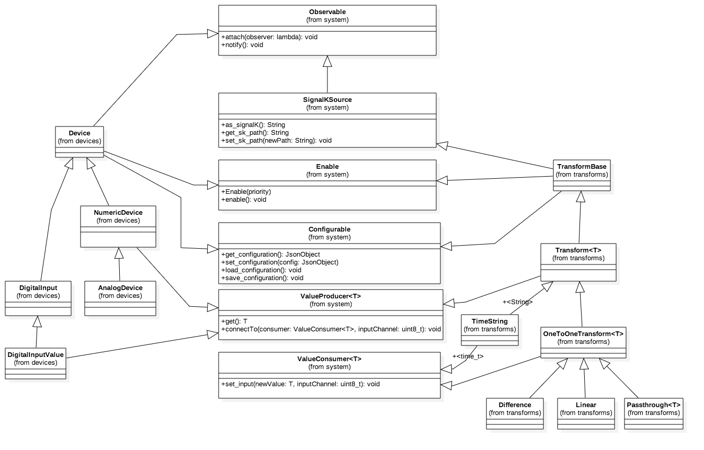

# SensESP

SensESP is a Signal K sensor development library for ESP8266
and ESP32. It can be used as a high-level toolkit for
creating ESP-based hardware sensoring devices that interface with Signal K
servers.

SensESP is heavily inspired by [SigkSens](https://github.com/mxtommy/SigkSens)
and prior work done by [@mxtommy](https://github.com/mxtommy).

Class documentation for SensESP is [here](http://signalk.org/SensESP/annotated.html).

A Wiki page with more detailed information about using SensESP is [here](https://github.com/SignalK/SensESP/wiki).

## Getting Started

You must have a Signal K Server running on your network, or SensESP has nothing to connect to. The most common installation is the Signal K node server running on a Raspberry Pi. Installation instructions for that are [here](https://github.com/SignalK/signalk-server-node/blob/master/raspberry_pi_installation.md).

Once the SK Server is installed and running, go to the Dashboard (enter `localhost:3000` into the Raspberry Pi's browser to start it), select Server - Settings from the left side menu, and make sure the "mdns" option is ON.

SensESP is a library and will be installed automatically as a dependency when defined as such in the project's
`platformio.ini` file. Instructions below.

You need to have PlatformIO installed. First, download and install [Visual Studio Code](https://code.visualstudio.com/).
Then, select "Extensions" from the left toolbar. Search for "platformio", select the first result, and click "Install".

Once you have PlatformIO installed, its home screen should open automatically when you start VSCode. On the PIO Home,
select "New Project". Enter a name (something like SensESPTest for your first project) and then select "WeMos
D1 R2 and mini" in the board dropdown. (This assumes you're using the most commonly used microcontroller with SensESP,
the Wemos D1 mini, an implementation of the ESP8266 chip. If you're using a different ESP, select that in the 
board dropdown. If you're using an ESP32 that isn't in the board list, choose "Espressif ESP32 Dev Module".)
The Arduino framework should become automatically selected. Complete the New Project dialog, then open the project you created.

Once you have your new project open, open the `platformio.ini` file that's in your project's directory (NOT the one that you find if you go down into the .pio/libdeps/... folders). Add the SensESP dependency to the section for your board:
```
lib_deps =
    https://github.com/SignalK/SensESP.git
```

Look at [this file](https://github.com/SignalK/SensESP/blob/master/platformio.ini). Notice there are two `env` sections: `[env:d1_mini]` and `[env:esp32dev]`. `[env:d1_mini]` is for the Wemos D1 Mini ESP8266. If your board is an ESP8266, copy all of the lines from that section into the `env` section of your platformio.ini. `[env:esp32dev]` is for a basic ESP32. If your board is an ESP32, opy all the lines from that section into the `env` section of your platformio.ini.

Then, open `src/main.cpp`. The default template is for the Arduino IDE, but a SensESP main.cpp file will look very different. Replace the contents of `main.cpp` with the contents of one of the SensESP examples in the `examples` subdirectory here on GitHub. (This is a good one to start with: https://github.com/SignalK/SensESP/blob/master/examples/analog_input.cpp .) Check that the settings (pin numbers, etc.) match your hardware and select "Build" from the PlatformIO submenu (the little alien face) on the left toolbar. If the build succeeds, you can plug in your ESP board and press "Upload and Monitor".

If the project compiles and uploads, your ESP will be running the example code. Since the first thing it needs to do is connect to a wifi network, and it doesn't know what network to connect to, it will broadcast a wifi SSID for you to connect to so you can configure it. Connect your computer or phone wifi to the "Configure sensesp" network. A captive portal may pop up, but if it doesn't, open a browser and go to 192.168.4.1. Enter your wifi credentials to allow the device to access the network that your Signal K Server is on. Also enter a suitable name for the ESP, for example `BilgeMonitor` or `EngineTemps`. (No more than 16 characters, no spaces.) Save the configuration with the button on the bottom of the page, and the ESP will restart and try to connect to your wifi network.

Once on the network, SensESP should automatically find your Signal K server, assuming it has mDNS enabled (see instructions above). ESP32 ONLY: If you see (in the Serial Monitor) that your ESP32 is restarting over and over, with these as the last lines of each failure:
```
␛[0m(I) (enable)(C1) All sensors and transforms enabled
␛[0m(D) (connect)(C1) Initiating connection
␛[0mGuru Meditation Error: Core  1 panic'ed (LoadProhibited). Exception was unhandled.
```
it means that your Signal K Server is not responding to the ESP's mDNS request. On your Signal K Server Dashboard, click the "Restart" button. It should restart in a few seconds, and then you should see that the ESP32 is no longer failing after `Initiating connection`. (There is an Issue to try to handle this condition more gracefully, but the Server restart seems to always fix it, so for now, that's what we've got.)

If your server has security enabled (it does by default), you should see an access request for your ESP in the Signal K Dashboard, under Security - Access Requests. (You must be logged into the Signal K Server to see the Security sub-menu.) Set the "Authentication Timeout" field to "NEVER", set the Permission to "Read / Write", then Approve it. You should start getting data on the Signal K Instrument Panel. (Dashboard - Webapps - Instrument Panel) You can see lots of activity in the Serial Monitor, including the connection to the Signal K Server, the request for and approval of the security token, and the flow of data.

ESP32 ONLY: in the Serial Monitor, until you authorize the security request, you'll see that the ESP32 is continually getting to the following point, and failing:
```
[0m(D) (poll_access_request)(C1) Polling SK Server for authentication token
␛[0m(D) (poll_access_request)(C1) PENDING
␛[0mGuru Meditation Error: Core  1 panic'ed (LoadProhibited). Exception was unhandled.
```
Once you approve the security request, the ESP will do this a few more times, and then it will see the authorization, and will then continue on, and finally start sending data to the Signal K Server. (There is an Issue to try to handle this condition more gracefully, but approving the security request on the server solves it, and it happens only once, so for now, that's what we've got.)

## Low-level "wiring"

This refers to how you actually use the SensESP library to "wire" (in software) a sensor to send its output to the Signal K Server. Rather than explain it here, just look at the examples - most of them have a lot of comments that describe how this works. Showing is better than telling in this case.

## Runtime setup

You can configure your device with any web browser by putting the IP address of your device into the URL field of the browser, or by going to

    http://sensesp.local (where "sensesp" is the name you gave your device when you configured the wifi credentials)

You can find the IP address of your device in the Serial Monitor, right after the line showing that it has connected to your wifi.     


Everything that is configurable on a "live" device will be in the menu that appears. As you'll see in the examples, this includes things like how often you want to read the sensor (usually represented as "read_delay"), how many samples you want in the MovingAverage() transform, what multiplier and offset you want in the Linear() transform, etc., etc. You can also rename the device from that menu, and restart the device, and even reset the device to factory settings (which erases the wifi credentials and the device name).

## SensESP Class Diagram
----------------------------

