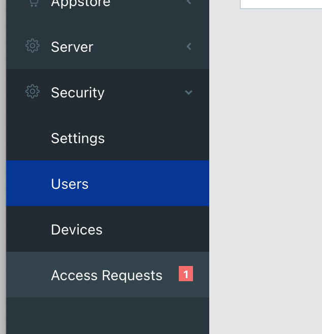
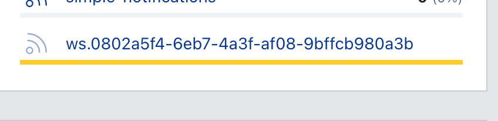

# Getting Started

## Expected Skills

The Quick Start Guide is intended for people with at least some basic software development skills.
If you are a total newbie to software development and microcontrollers, see the [tutorials](../tutorials/) for slower-paced guides.

## Prerequisites: Hardware

To get started with SensESP development, first you need some suitable hardware.
A good low-cost option is an ESP32-DevKit board.
Search AliExpress, Amazon, Ebay, or other marketplace of your choice for "ESP32-DevKitC v4".
Pick one with a WROOM-32D or WROOM-32E module.
Others are available and will likely work, but those are the sure-fire ones.

The ESP32-DevKit boards are dirt cheap and great for testing and development on a lab desk, but integrating them in a "production" environment on a boat requires external power sources and enclosures and can be a hassle.
For onboard purposes, a [Sailor Hat with ESP32 (SH-ESP32)](https://hatlabs.fi/product/sailor-hat-with-esp32/) is a great option.
The SH-ESP32 has an integrated wide voltage range power supply, an NMEA-2000 compatible isolated CAN interface, a selection of suitable enclosures and connectors, and lots of other goodies for marine sensor development.
And by purchasing one, you'll support SensESP development. ;-)

While usable as is, you will get the most out of a SensESP device if you can connect it to a [Signal K](http://signalk.org/) server.
Read the Signal K [Info](https://signalk.org/overview.html) and [Installation](https://signalk.org/installation.html) pages for more information on the hardware choices and setting one up.
This tutorial assumes that you already have a Signal K server running on your local network.

## Prerequisites: Software

It is possible to work on SensESP projects on Linux, Mac, or Windows.
Linux and Mac or both equally convenient.
On Windows, you might have to install some additional tools like a Git client, and adapt the instructions accordingly.

SensESP projects use [PlatformIO](https://platformio.org/) to build and upload the device firmware.
You would normally use [Visual Studio Code](https://code.visualstudio.com/) as a development IDE.
If you're happy with that, install Visual Studio Code.
PlatformIO will be installed automatically when you open the project.

If Visual Studio Code is not the way you roll, install the [PlatformIO Core command-line interface](https://docs.platformio.org/en/latest/core/index.html).
You will be able to utilize all of PlatformIO's features but you might have to adapt the instructions accordingly.

## Downloading a Project Template

For a running start, it is strongly recommended to start with a ready-made project template.
Download the [SensESP Project Template](https://github.com/SensESP/SensESP-project-template).
You can either clone the repo (if you’re comfortable with Git) or download the source code as a zip file by clicking on the green “Code” button and selecting “Download ZIP”.
If you went with the Zip file, unzip the package in a directory of your choice.

## Building and Installing the Project Template

Open the project template directory in Visual Studio Code.
VSCode should automagically detect that the directory is a PlatformIO project and recommend installing it.
Play along and reload the window when requested.
Next, PlatformIO will pick up and download the ESP32 SDKs and all dependencies in the background.
This is indicated by the "PlatformIO: Rebuilding IntelliSense Index" message in the status bar.
When the download is complete, the message will disappear and the project template is ready to use.

At this point, connect your ESP32 device to your computer with a MicroUSB cable (not provided).
You're now ready to build and upload the project to the device.

If not already visible, open the PlatformIO sidebar by clicking the PlatformIO alien icon in the left sidebar.
Then, upload the project by selecting "Project Tasks -> esp32dev -> General -> Upload and Monitor" in the left hand side PlatformIO menu.
This will perform three things:

1. Build the firmware
2. Upload the firmware to the device
3. Start the serial port monitor

(If any of these fail, try the individual Build, Upload, and Monitor steps and observe the output in the Terminal window.)

Assuming everything went smoothly, you should see some output in the Terminal tab at the bottom panel, indicating that the project template has been successfully installed and started on the device.

If you're playing along on the command line, `pio run -t upload` will build and upload the project.
You have to start the serial monitor manually by running `pio device monitor`.

## WiFi Configuration

If a WiFi access point hasn't been configured yet, SensESP will create a special configuration access point for you.
Open the list of nearby WiFi APs on your phone or computer and connect to the network named "Configure my-sensesp-project".
The default network password is `thisisfine`.

Normally, the WiFiManager configuration screen should automatically pop up.
If that doesn't happen, browse to the captive portal IP address `192.168.4.1` in your web browser.

Select the Wi-Fi network you prefer and enter the password, save and close.
The device should now automatically connect to the network.

Verify in the serial monitor output that the device connects properly to the WiFi.
Assuming that is the case, you can now continue with the next step.

## Signal K Authorization

The device is now on the WiFi network.
If you have a Signal K server running
and automatic mDNS/Avahi service discovery correctly configured, you should immediately have a device access request appear on the Signal K server web UI:

{:width="50%"}

Open the access request, set authentication timeout to “NEVER”, and click Approve.
You should immediately get new data on the Signal K server dashboard and data browser.

SensESP device on the dashboard:

{:width="50%"}

Published paths on the data browser:

## Observe Data from the Device

You should have two new paths visible on the Signal K data browser:

- `sensors.analog_input.voltage`
- `sensors.digital_input2.value`

These are not terribly interesting as is, but let's make the values change!

Connect a piece of jumper wire from a 3.3V pin to the GPIO pin 36 on the ESP32 device.
(On SH-ESP32 boards, the pin is labeled `VP`.)
You should see the analog input voltage jump to close to 3.3V.

Next, connect the jumper wire between GND and GPIO pin 13.
This should make the digital input 2 value change to `false`.

Finally, you can connect a jumper wire between GPIO pins 15 and 13.
This should make the digital input 2 value toggle periodically between `false` and `true`.

Congratulations!
You've successfully installed and configured your new SensESP device.

## Next Steps

Now that your device is up and running, have a look at the source code in the `src` directory.
The project template illustrates some core SensESP concepts.
Remove the pieces you don't need and start adding new stuff.

If you want to use an external sensor device, check first the [Add-ons page](..//additional_resources/add-ons/) to see if a SensESP specific add-on is available.
However, if a device has an ESP32-compatible Arduino framework library available, you can usually add support for it using the `RepeatSensor` class.
See the [BMP280 Tutorial](../tutorials/bmp280/) for an example.

If you have created someting that works for you, share your work so that others can use your code as an example!

These are the steps required to make a project based on the template your own:

1. Rename the project directory to describe your project.
2. If you cloned the project from GitHub, the project `origin` remote repository points to the template repo.
   To remove that link, run this: `git remote remove origin`.
3. Update the `README.md` file contents to describe the project.
   It is recommended to do so regardless of whether you are going to share the project or not.
   Your future self will thank you!

If you want to share your work, follow these three additional steps:

[comment]: <> (Just-the-docs CSS always resets the OL counter. An issue filed: https://github.com/pmarsceill/just-the-docs/issues/750)
{:start="4"}
4. Verify that the project license (as defined in the `LICENSE` file) suits your preferences.
5. Create a new repo on GitHub and push the project to it.
6. Get your project added to the [examples list](../additional_resources/add-ons/#examples-and-related-projects) by creating either a new issue or a pull request in the [SensESP repository](https://github.com/SignalK/SensESP).
