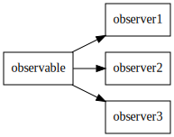
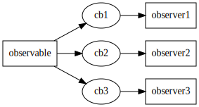
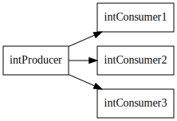

# Internals

SensESP builds on a number of interface classes and abstractions and following the code logic can feel overwhelming if you're not familiar with the concepts.
This page provides a brief overview of the internals of the library.

## Observables

The `Observable` base class implements the [Observer pattern](https://en.wikipedia.org/wiki/Observer_pattern).
Any class inheriting from `Observable` can be observed.
In practical terms, you can call `observable->attach(cb)` to attach the callback `cb` to the `Observable` instance.
When the `Observable` instance value is updated, the `notify()` method is called, causing all the attached callbacks to be called in turn.

The value in having Observables is that you don't have to know in advance who is interested in object value updates, or how many interested parties there are.

Usually, the attached callback will propagate the new value of the `Observable` to the observer object.

This simplified graph shows an `Observable` with three observers:

This is the same graph with the callbacks shown:

## Producers and Consumers

Moving forward from Observables, we have Producers and Consumers, implemented in the `ValueProducer` and `ValueConsumer` classes respectively.

Producers are Observables that additionally define a `connect_to()` method that can be used to connect the Producer to a Consumer.
The `connect_to()` method creates a standardized callback between the two objects, thus allowing you to connect the two without having to define the callback yourself.

Consumers, on their turn, are classes that implement the `set_input()` method that the Observable callback will call.
Consumers also define a `connect_from()` convenience method for connecting the Consumer to a Producer.
`connect_from()` is a bit more complex than `connect_to()` because it "goes against the flow", so to speak, but it can come in handy in many situations.

It is common for a class to be both a `ValueProducer` and a `ValueConsumer`. Such classes typically receive values, perform some operations, and then notify their consumers, thus creating a _transform_ of the input. `Transform` classes are described in the [Transforms](#Transforms) section.

An important difference between Observables and Producers is that Producers are typed. `ValueProducer` is a template class that, when instantiated, will also have its output type defined.
This means that a `StringProducer` cannot be connected to an `IntConsumer` because the types don't match.

There is nothing wrong in using the `ValueProducer<T>` and `ValueConsumer<T>` classes directly, but some pre-specialized convenience classes have been defined for common use cases:

- `FloatProducer`
- `IntProducer`
- `BoolProducer`
- `StringProducer`

The value propagation graph for Producers and Consumers is almost identical to the one for Observables.
Shown here is an example of IntProducers and IntConsumers:

Automatic type conversions for types that can be converter with a type cast are also available.
Hence, it is possible to connect a `IntProducer` to an `FloatConsumer`, etc.
Converting from `String` to `bool`, for example, is not possible because no such type cast exists.
Manual conversion can be created with a `LambdaTransform`, for example.

`ObservableValue` is one of the simplest Producers.
By itself, it does nothing, but it implements the `ValueProducer` interface, and you can connect `ValueConsumer` objects to it.
If you update the value of the `ObservableValue`, all the connected consumers will be notified.
This approach can be used to inject arbitrary data into SensESP processing networks.

## Configurables

Many SensESP objects benefit from having a configuration interface and means for storing and retriveing configuration values from a persistent storage.
The `Configurable` class is a base class for all such objects.

`Configurable` objects can read and write their configuration values by defining `set_configuration()` and `get_configuration()` methods.
The method naming can be a bit confusing: `set_configuration()` sets the values of object member variables, while `get_configuration()` returns an `ArduinoJson` object filled with the member variable values.
Hence, `set` loads and `get` saves the configuration.

`Configurable` objects also normally define a config schema, acquired by calling `get_config_schema()`.
The config schema is used to render the configuration page in the web interface.

## Resettables and Startables

Some additional base classes exist for objects that can be reset and that have additional startup routines.
These inherit from `Resettable` and `Startable` base classes.

`Startable`s are more interesting and will be discussed first.

A `Startable` object is something that should be somehow enabled or started when all other objects have been initialized and we want to actually start running the program.
The startup routine is defined by the `start()` method implemented by the inheriting class.

For example, basic WiFi networking objects should be initialized before the websocket connection to the Signal K server is attempted because the latter may utilize the former.
It should be noted, however, that network connections, in particular, are established asynchronously.
Returning from the `start()` call only signals that we have started establishing the connection, not that the connection already exists.

The `Startable` constructor has an optional `priority` parameter that can be used to control the object startup order.
Higher numbers come first and negative numbers are allowed.
The priority definitions are arbitrary, but some of the currently defined values are:

| Priority     | Subsystem            |
|-------------:|:---------------------|
| 80           | WiFi networking      |
| 60           | SK Websocket client  |
| 50           | HTTP server          |
| 10           | Sensors              |
| 5            | Transforms           |
| 0            | Default value        |

A `Resettable` object is something that should be called when the ESP device is factory reset.
Currently, the only use cases for `Resettable` are initializing the file system and the WiFi network settings.

Similar to `Startable`, the `Resettable` constructor has an optional `priority` parameter that can be used to control the object reset order.

The currently defined values are:

| Priority     | Subsystem            |
|-------------:|:---------------------|
| 0            | WiFi networking      |
| -100         | File system          |

## Sensors

Sensors are classes that read value from some real-world source and provide them to the rest of the system.
Building on the concepts described above, a `Sensor` subclass is a `ValueProducer` of a certain type, a `Configurable`, and a `Startable` (even though the default `start()` method does nothing and is usually not overridden). In other words, it is something that you can attach Observables or Consumers to, which can store and retrieve its own configuration (and can be configured via the web interface), and can define its own startup routine.

Like ValueProducers, all Sensors inherit from the `SensorT<T>` template class, and there are pre-specialized classes for convenience: `FloatSensor`, `IntSensor`, `BoolSensor`, and `StringSensor`.

When creating new sensor classes, inheriting from `Sensor` requires writing quite a bit of boilerplate that may not be very relevant for simple sensor classes.
If you are creating a new sensor that simply reads a value using an external library at given time intervals, you can use the `RepeatSensor` class instead.

Sensors are further discussed on the [Sensors section of the Concepts page](../concepts#sensors).

## Transforms

Transforms are classes that take a value in, perform some operation on the value, and then spit a new value out.
They implement both `ValueProducer` and `ValueConsumer` interfaces.
Furthermore, the `Transform` class is a `Configurable` and a `Startable`.

The input and output types of a Transform do not have to be the same, and often aren't.

In many common cases, defining a new Transform subclass is a lot of work and can be avoided by using the `LambdaTransform` class.
A LambdaTransform is a class that takes a lambda function as a parameter, conveniently avoiding the need to define a new class.

Transforms are further discussed on the [Transforms section of the Concepts page](../concepts#transforms).

## Configuration API

The web user interface of SensESP is implemented using a RESTful configuration API that can be used independently of the web UI.
It would, for example, be possible to create a Signal K plugin for configuring all connected sensors over their configuration interfaces.

Regular SensESP devices listen to HTTP port 80. The following calls are supported:

| Path            | Method | Description          |
|:----------------|:-------|:---------------------|
| /config         | GET    | Get a list of all configuration paths |
| /config/PATH    | GET    | Get the Json configuration object for configuration path PATH |
| /config/PATH    | PUT    | Update the configuration for path PATH |
| /info           | GET    | Get information text for the device |
| /device/reset   | GET    | Factory reset the device |
| /device/restart | GET    | Restart the device |
