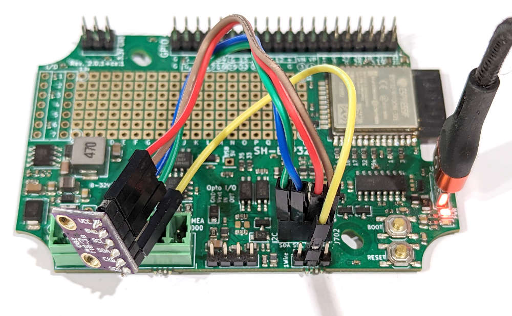

# Mix and Match SensESP with Arduino Style Code

While the ReactESP and SensESP features such as the reactions and the producers, consumers and transforms are very powerful, they are not for everyone. This tutorial shows how to use SensESP to only deal with the Signal K networking, and use Arduino-style code to handle the rest.

After reading this tutorial, you should be able to use SensESP together with existing Arduino style code examples. SensESP will take care of initializing the WiFi and the Signal K connection, and you can use the Arduino style code to read sensors and send data to Signal K.

We'll use an SH-ESP32 board in this tutorial and connect it to a BME280 humidity and pressure sensor. The BME280 is a very popular sensor, and there are many Arduino examples available for it. We'll use one of those examples to read the sensor, and then send the data to Signal K using SensESP.

However, despite using an Arduino Sketch as an example, we will be using PlatformIO to build and upload the code. PlatformIO will manage the dependencies and libraries for us and is an integral part of the SensESP development environment. You will not succeed in getting SensESP to work with Arduino IDE!

Below is a photo of our development setup. We are using a generic BME280 breakout board from AliExpress. You'll find many similar boards on eBay and Amazon as well. Since the pin ordering of the breakout board is different from the SH-ESP32 I2C header, we use four jumper wires to connect the breakout board to the SH-ESP32.



The breakout board I found in my parts drawer happened to have the BME280 SDO pin broken out. The SDO pin is used to set the I2C address of the BME280 and must be connected. Normally, the address is pre-selected on the breakout board, and you don't need to fiddle with it. In my case, I had to connect the SDO pin to 3.3V, which will set the I2C address to 0x77. (If you connect it to GND, the address will be 0x76.) I just added a fifth jumper wire to connect the SDO pin to 3.3V.

## The Arduino Sketch

For this tutorial, we are modifying the example code provided by the [Random Nerd Tutorials BME280 Guide](https://randomnerdtutorials.com/bme280-sensor-arduino-pressure-temperature-humidity/). We are first going to run the code on the SH-ESP32 in PlatformIO to make sure our hardware is working. Then, we'll modify the code to let SensESP take care of the Signal K connection and transmit the data to the Signal K server.

The full original Arduino sketch is available below:

```cpp
/*
 * Complete Project Details https://randomnerdtutorials.com
*/

#include <Wire.h>
#include <SPI.h>
#include <Adafruit_Sensor.h>
#include <Adafruit_BME280.h>

#define BME_SCK 13
#define BME_MISO 12
#define BME_MOSI 11
#define BME_CS 10

#define SEALEVELPRESSURE_HPA (1013.25)

Adafruit_BME280 bme; // I2C
//Adafruit_BME280 bme(BME_CS); // hardware SPI
//Adafruit_BME280 bme(BME_CS, BME_MOSI, BME_MISO, BME_SCK); // software SPI

unsigned long delayTime;

void setup() {
  Serial.begin(9600);
  Serial.println(F("BME280 test"));

  bool status;

  // default settings
  // (you can also pass in a Wire library object like &Wire2)
  status = bme.begin();
  if (!status) {
    Serial.println("Could not find a valid BME280 sensor, check wiring!");
    while (1);
  }

  Serial.println("-- Default Test --");
  delayTime = 1000;

  Serial.println();
}


void loop() {
  printValues();
  delay(delayTime);
}


void printValues() {
  Serial.print("Temperature = ");
  Serial.print(bme.readTemperature());
  Serial.println(" *C");

  // Convert temperature to Fahrenheit
  /*Serial.print("Temperature = ");
  Serial.print(1.8 * bme.readTemperature() + 32);
  Serial.println(" *F");*/

  Serial.print("Pressure = ");
  Serial.print(bme.readPressure() / 100.0F);
  Serial.println(" hPa");

  Serial.print("Approx. Altitude = ");
  Serial.print(bme.readAltitude(SEALEVELPRESSURE_HPA));
  Serial.println(" m");

  Serial.print("Humidity = ");
  Serial.print(bme.readHumidity());
  Serial.println(" %");

  Serial.println();
}
```

## Running the Arduino Sketch on SH-ESP32

The following text assumes you have already installed PlatformIO and git. If you haven't, please read the [Getting Started](/pages/getting_started/) Section first.

First, we will download the SensESP Project Template, rename the folder and open it in PlatformIO.
The last command might fail if you haven't installed the VSCode shell command yet (Cmd/Ctrl-Shift-P, type "shell", select "Shell Command: Install 'code' command in PATH" and press Enter).

```bash
git clone https://github.com/SensESP/SensESP-project-template.git
mv SensESP-project-template SensESP-bme280
cd SensESP-bme280
code -n .
```

You might first want to build and upload the project to make sure everything is working. To do so, select the "Upload and Monitor" command in the PlatformIO sidebar. If everything is working, you should see some SensESP related output on the serial monitor. Great! The basic development setup is working!

Next, let's add the BME280 library to the project. We'll use the [Adafruit BME280 Library](https://github.com/adafruit/Adafruit_BME280_Library) for this. Open the `platformio.ini` file in the root of the project and add the following line to the `lib_deps` section:

```ini
adafruit/Adafruit BME280 Library @ ^2.2.2
```

This will make PlatformIO download the library and install it in the project. You can now use the library in your code.

Let's replace the contents of `src/main.cpp` with the Arduino sketch above. We'll want to make some minor changes to the code.
First, let's bump the serial monitor speed to 115200 bps. Replace the line `Serial.begin(9600);` with `Serial.begin(115200);`.
While there, also add a small delay after that line. This is required to properly initialize the serial port before trying to output anything to it. Add the following line after the `Serial.begin(115200);` line:

```cpp
delay(100);
```

Next, the SH-ESP32 I2C pins are on different GPIO pins than expected by the Arduino code. Let's add the correct pins as constant macros next to the other `#define`s at the top of the file:

```cpp
#define SDA 16
#define SCL 17
```

Then, we'll need to initialize the I2C bus with the correct pins. Insert the following line after the `Serial.begin(115200);` line:

```cpp
Wire.begin(SDA, SCL);
```

Before running the code, we still need to do one more modification. The `printValues()` function is used before it has been declared, and that won't work in standard C++. So, let's move the function definition above the `setup()` function. Cut the whole `printValues()` function at the end of the file and paste it right above the `setup()` function.

You can now build and upload the code to the SH-ESP32. If everything is working, you should see the sensor values printed on the serial monitor:

```text
BME280 test
-- Default Test --

Temperature = 25.84 *C
Pressure = 1002.70 hPa
Approx. Altitude = 88.23 m
Humidity = 31.21 %
```

The pressure value is very close to the one reported by the nearest weather station. The actual altitude above sea level is more like 12 m, but the reported value varies depending on the atmospheric pressure. Humidity value is likely to be correct, but the temperature is quite a bit off. Maybe the sensor is a knockoff? Luckily, that's not important for this tutorial, and we can even do some calibration in the code later.

## Adding SensESP Connectivity

Now that we have the numbers coming in, let's connect the device to a Signal K server. We'll let SensESP take care of the WiFi and Signal K connectivity, and create SK delta output objects for each of the sensor values.

First, let's add the required header file include statements to the `src/main.cpp` file. Add these lines after the other `#include` statements:

```cpp
#include "sensesp/signalk/signalk_output.h"
#include "sensesp_app_builder.h"
```

The `sensesp_app_builder.h` file contains the `SensESPAppBuilder` class, which we'll use to build the SensESP app. The `signalk_output.h` file contains the `SKOutput` class, which we'll use to create the Signal K output objects.

We'll also need to add a namespace definition and create the ReactESP app that SensESP uses to run the code. Add the following lines after the `#define` statements:

```cpp
using namespace sensesp;

reactesp::ReactESP app;
```

Next, we'll create the SensESP application using the builder class. Add the following lines to the `setup()` function, right before the `Wire.begin()` line:

```cpp
  SensESPAppBuilder builder;
  sensesp_app = (&builder)
                    ->set_hostname("sensesp-bme280")
                    ->get_app();
```

This will create a SensESP app with the hostname `sensesp-bme280`. You can change this to whatever you want, but make sure it's unique on your network. The builder class also allows you to set the WiFi SSID and password and other settings, if needed. See the [SensESPAppBuilder](/generated/docs/classsensesp_1_1_sens_e_s_p_app_builder.html) documentation for more information.

One more thing to do is to add the `app.tick();` command to the end of the `loop()` function. This call triggers execution of any ReactESP reactions that have been scheduled.

Now, let's start our program. Add the line `sensesp_app->start();` at the very end of the `setup()` function. This will start the SensESP app and connect to the WiFi network.

We're almost ready to give it a go! There's one more thing that is unobvious but very important. Have a look at the current `loop()` function:

```cpp
void loop() {
  printValues();
  delay(delayTime);

  app.tick();
}
```

Every time it is run, after printing the values, the software will sleep for `delayTime` (1000) milliseconds, or one second. And only after that it calls the `app.tick()` function that is responsible for handling network connectivity, receiving and transmitting data, updating the web UI and a myriad of tasks. All these would only be called once every second, which is not even nearly enough for the software to work properly!

A major, fundamental rule in asynchronous programming (of which ReactESP is a simple example) is that you should never block the main loop. If you do, you'll block all the other tasks as well. So, let's remove the `delay(delayTime);` line from the `loop()` function.

Normally, we'd add an `onRepeat` reaction to call the `printValues()` function every second, but since I promised to minimise the use of ReactESP and SensESP constructs, we'll implement a simple timer using the Arduino `millis()` function. Replace the `loop()` function with the following code:

```cpp
void loop() {
  static unsigned long last_run = millis();

  if (millis() - last_run >= delayTime) {
    printValues();
    last_run = millis();
  }

  app.tick();
}
```

The first line instantiates a variable calling `last_run` that is `static`, meaning that after the first iteration, it will retain its value between function calls. This is important, because we want to know when the last time the function was called. The `millis()` function returns the number of milliseconds since the program started, so we can use that to check if the required time has passed since the last call. If it has, we call the `printValues()` function and update the `last_run` variable[^1].

[^1]: This code has an unobvious but significant flaw: once the `millis()` value overflows, the values will start again from zero, and the `if` statement will never be true again. An `unsigned long` variable is 64 bits long, with the maximum decimal value being 18&nbsp;446&nbsp;744&nbsp;073&nbsp;709&nbsp;551&nbsp;616. If you divide that by 1000, you'll get 18&nbsp;446&nbsp;744&nbsp;073&nbsp;709&nbsp;551 seconds, or 584&nbsp;554&nbsp;049 years. Be sure not to leave your device running for that long!

Try uploading the code. If you get a note that WiFiManager is started, you need to configure the WiFi settings. Connect to the WiFi network named `Configure sensesp-bme280` with password "thisisfine". You should see a captive portal page where you can select your WiFi network and enter the password. After that, the device should connect to the network. At this point, the blue LED should start flashing, indicating that the device is connected to the network. You should also see the sensor values printed on the serial monitor, along with some status messages from SensESP.

## Adding Signal K Output

Now that we have the device connected to the network, let's add Signal K output. We'll create three SKOutput objects, one for each of the sensor values. Add the following variable declarations to the top of the `src/main.cpp` file, after the `delayTime` declaration:

```cpp
SKOutput<float>* pressure_output;
SKOutput<float>* temperature_output;
SKOutput<float>* humidity_output;
```

And then, in `setup()`, let's create the `SKOutput` objects. Add the following lines to the `setup()` function, right before the `sensesp_app->start();` line:

```cpp
  pressure_output = new SKOutput<float>(
    "environment.cabin.pressure",
    "/sensors/bme280/pressure",
    new SKMetadata("Pa", "Cabin barometric pressure")
  );

  temperature_output = new SKOutput<float>(
    "environment.cabin.temperature",
    "/sensors/bme280/temperature",
    new SKMetadata("K", "Cabin temperature")
  );

  humidity_output = new SKOutput<float>(
    "environment.cabin.humidity",
    "/sensors/bme280/humidity",
    new SKMetadata("ratio", "Cabin relative humidity")
  );
```

These lines create three `SKOutput` objects, one for each of the sensor values. The first parameter is the Signal K path, the second is the configuration path displayed in the web UI, and the third is the metadata. The metadata is optional, but it's a good idea to include it, because it allows the Signal K server to display the units and description of the value.

Now, we need to feed values to the three output objects. To do this, let's modify our `printValues()` function. Replace the `printValues()` function with the following code:

```cpp
void printValues() {
  float temperature_K = bme.readTemperature() + 273.15F;
  float pressure_Pa = bme.readPressure();
  float humidity_ratio = bme.readHumidity() / 100.0F;

  temperature_output->set_input(temperature_K);
  pressure_output->set_input(pressure_Pa);
  humidity_output->set_input(humidity_ratio);

  Serial.println();
}
```

This reads the sensor values into variables and also converts units to the standard SI units expected by the Signal K server. The variable values are then inserted to the respective Signal K output objects which take care of converting the data into JSON and transmitting them to the Signal K server over websockets. As a side effect, the Signal K deltas are printed out to the serial monitor. You can see the values appear in the Signal K server's Data Browser:


## Complete Code

Here's the complete code for the `src/main.cpp` file:

```cpp
#include <Wire.h>
#include <Adafruit_BME280.h>
#include "sensesp/signalk/signalk_output.h"
#include "sensesp_app_builder.h"

#define SDA 16
#define SCL 17

using namespace sensesp;

reactesp::ReactESP app;

Adafruit_BME280 bme;

unsigned long delayTime = 1000;

SKOutput<float>* pressure_output;
SKOutput<float>* temperature_output;
SKOutput<float>* humidity_output;

void printValues() {
  float temperature_K = bme.readTemperature() + 273.15F;
  float pressure_Pa = bme.readPressure();
  float humidity_ratio = bme.readHumidity() / 100.0F;

  temperature_output->set_input(temperature_K);
  pressure_output->set_input(pressure_Pa);
  humidity_output->set_input(humidity_ratio);
}

void setup() {
  Serial.begin(115200);
  delay(100);
  Serial.println(F("BME280 test"));

  SensESPAppBuilder builder;
  sensesp_app = (&builder)
                    ->set_hostname("sensesp-bme280")
                    ->get_app();

  Wire.begin(SDA, SCL);

  bool status;

  status = bme.begin();
  if (!status) {
    Serial.println("Could not find a valid BME280 sensor, check wiring!");
    while (1);
  }

  pressure_output = new SKOutput<float>(
    "environment.cabin.pressure",
    "/sensors/bme280/pressure",
    new SKMetadata("Pa", "Cabin barometric pressure")
  );

  temperature_output = new SKOutput<float>(
    "environment.cabin.temperature",
    "/sensors/bme280/temperature",
    new SKMetadata("K", "Cabin temperature")
  );

  humidity_output = new SKOutput<float>(
    "environment.cabin.humidity",
    "/sensors/bme280/humidity",
    new SKMetadata("ratio", "Cabin relative humidity")
  );

  sensesp_app->start();
}

void loop() {
  static unsigned long last_run = millis();

  if (millis() - last_run >= delayTime) {
    printValues();
    last_run = millis();
  }

  app.tick();
}
```

## Summary

In this tutorial, we've learned how to adapt a basic Arduino example program to output data to Signal K. We have consciously minimized the use of SensESP and ReactESP constructs, to illustrate that SensESP can be used with any Arduino program, not just those that are written with SensESP in mind. In other words, you don't have to go all-in with SensESP!
