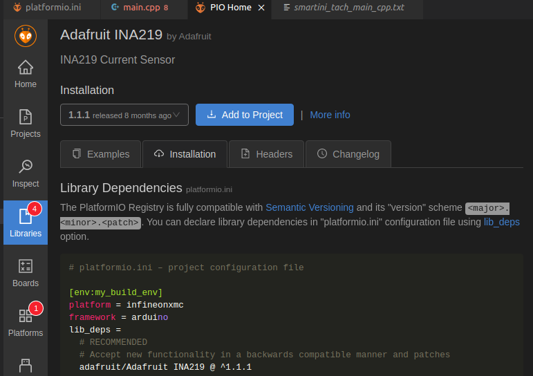

# Using `RepeatSensor` with ANY External Hardware Sensor Library

[The previous part of this tutorial](../bmp280) illustrated how to use a very generic approach, using a SensESP `RepeatSensor` class, to read the temperature from an Adafruit BMP280.
This tutorial will build on that, explaining how to take that approach with almost any hardware sensor with Arduino framework compatible library.

For our example, we'll use another real physical sensor that you might want to use on your boat: an INA219 High-side DC Current Sensor.
But you can go through all of these same steps for almost any sensor to make it work with SensESP.

You'll start with the same two files (`platformio.ini` and `main.cpp`) that you worked with in the previous Tutorial.

## platformio.ini

Look at the `lib_deps` section of the `platformio.ini`. It lists two libraries:

```c++
lib_deps =
  SignalK/SensESP @ ^2.0.0
  adafruit/Adafruit BMP280 Library @ ^2.5.0
```

We need to replace the BMP280 library with the appropriate line for the INA219.
But how do we know what that line is?
The best way is to find it in PlatformIO - if it's registered with PlatformIO.
The only way to know is to look:

### Searching PlatformIO

1. Click the PlatformIO icon (the little alien face) on the far left side.
2. Click on "Libraries" in the menu that appears.
3. In the field where it says "Search libraries", type the name of your sensor.
   In this case, you'd type `INA219`, then hit ENTER or click the magnifying glass icon.
4. It's likely that several libraries will be found, so you have to decide which one you want to use.
   Check the popularity of the library, as indicated by the number of downloads.
   Most often, picking the most popular one is a safe bet.
   Otherwise, you need to look closer.
   If there is one from Adafruit, pick that one, unless you know that one doesn't work for your chip.
   If there isn't one that seems appropriate, skip down to the next section, "Searching Online".
5. Click on the name of the one you're going to use, and you'll see a lot of information about it.
6. Click on the "Installation" button, and you'll see options for what to use, typically showing you different ways to specify the version of the library to use.
   The first one listed will probably say "RECOMMENDED" - so use that one.
   In this case, it's `adafruit/Adafruit INA219 @ ^1.1.1`. (See the image below.)
7. Copy-paste that into your `lib_deps` section, in place of the BMP280 line above and save the change.
8. If you have trouble find a suitable hardware library, try the next section, "Searching Online".



### Searching Online

Sometimes, you'll have to do some searching online for a library to work with your sensor.
Hopefully, you'll find an example Arduino sketch somewhere that reads your sensor, and then you'll have to read the documentation that will show you how to use the library.

Let's say your sensor is an INA226, and you've decided to use [this library for it](https://github.com/RobTillaart/INA226).
In your `platformio.ini`, in place of the BMP280 line above, you'll use `https://github.com/RobTillaart/INA226`.
That will tell PlatformIO to download this library before trying to compile and build your project.

After you've added the appropriate library to `platformio.ini`, it's time to modify the program file, `main.cpp`.

## main.cpp

In this section, we'll go through each of the lines specific to the BMP280, and replace them with lines specific to the INA219.
We'll find those lines by looking at the basic example Arduino sketch that's in the Adafruit INA219 GitHub repository, [here](https://github.com/adafruit/Adafruit_INA219/blob/master/examples/getcurrent/getcurrent.ino).

```c++
// Sensor-specific #includes:
#include <Adafruit_BMP280.h>
```

In the INA219 example, you see a very similar line: `#include <Adafruit_INA219.h>`.
Replace the BMP280 header include with that one.

```c++
// Create an instance of the sensor using its I2C interface
Adafruit_BMP280 bmp280;
```

This line creates an instance of Adafruit_BMP280.
You'll replace it with the line from the INA219 example that creates the instance of the INA219: `Adafruit_INA219 ina219;`.

```c++
// Define the function that will be called every time we want
// an updated temperature value from the sensor. The sensor reads degrees
// Celsius, but all temps in Signal K are in Kelvin, so add 273.15.
float read_temp_callback() { return (bmp280.readTemperature() + 273.15); }
```

This line creates the function that reads the temperature from the BMP280 and converts it from Celsius to Kelvin.
We need to replace that with a line that creates the function that reads whatever value we want from the INA219.
The INA219 can read four different values - let's read current (in mA) for this tutorial.
Looking at the INA219 example, you see this line that reads current, and stores it in a variable called `current_mA`:

```c++
current_mA = ina219.getCurrent_mA();
```

Modifying the BMP280 line above, we get:

```c++
float read_current_callback() { return ina219.getCurrent_mA(); }
```

Notice that the reading is in mA.
Current is supposed to be sent to Signal K in amps, so the function really needs to be:

```c++
float read_current_callback() { return (ina219.getCurrent_mA() / 1000); }
```

While the above function is very simple - just one line - it doesn't have to be.
It can be several lines long, doing multiple tasks.
It just has to return the correct type, and be able to fully execute within the time set by your read_interval.

```c++
// Initialize the BMP280 using the default address
bmp280.begin();
```

This line is also a function from the Adafruit_BMP280 library - it starts, or initializes, the BMP280.
In the INA219 example, we see a similar line, but it's buried within a bunch of comments and other code:

```c++
// Initialize the INA219.
// By default the initialization will use the largest range (32V, 2A).  However
// you can call a setCalibration function to change this range (see comments).
if (! ina219.begin()) {
  Serial.println("Failed to find INA219 chip");
  while (1) { delay(10); }
}
// To use a slightly lower 32V, 1A range (higher precision on amps):
//ina219.setCalibration_32V_1A();
// Or to use a lower 16V, 400mA range (higher precision on volts and amps):
//ina219.setCalibration_16V_400mA();
```

Reading between the lines, you see that the code that actually initializes the sensor is just `ina219.begin()`, which is all we need in our `main.cpp`.
The rest of it is code to make sure the sensor is connected and working correctly, but that just complicates our tutorial, so we'll leave that out.

Notice the comments that tell you about calibration changes you can make with the INA219.
You could use either one of those in your `main.cpp` if you want to change the calibration.
Similarly, if your sensor has functions to calibrate it or set some other parameters, you can include those in `main.cpp`.
Basically, include anything that needs to be done to have your sensor ready to read data.

```c++
auto* engine_room_temp =
      new RepeatSensor<float>(read_interval, read_temp_callback);
```

This line uses `RepeatSensor` to create the "event" that reads the temperature from the BMP280 every `read_interval` ms.
Modifying it to work with the INA219 is simple:

```c++
auto* house_bank_current =
      new RepeatSensor<float>(read_interval, read_current_callback);
```

We just changed the name of the pointer from `engine_room_temp` to `house_bank_current`, and replaced `read_temp_callback` with `read_current_callback`, which we defined above.

```c++
  // Set the Signal K Path for the output
  const char* sk_path = "propulsion.engineRoom.temperature";

  // Send the temperature to the Signal K server as a Float
  engine_room_temp->connect_to(new SKOutputFloat(sk_path));
```

These two lines pass the value of `engine_room_temp` to Signal K as a Float, to the path `propulsion.engineRoom.temperature`.
We need to change the Signal K Path to an appropriate one for what's being measured, like `electrical.batteries.houseBank.current`, and send it to Signal K as a Float:

```c++
  // Set the Signal K Path for the output
  const char* sk_path = "electrical.batteries.houseBank.current";

  // Send the current to the Signal K server as a Float
  house_bank_current->connect_to(new SKOutputFloat(sk_path));
```

Or, to do the above two lines in just one line:

```c++
    // Send the current to the Signal K server as a Float
  house_bank_current->connect_to(new SKOutputFloat("electrical.batteries.houseBank.current"));
```

## Summary

* Almost any sensor can be used in SensESP by using a special Sensor called a RepeatSensor.
* You are responsible for writing a function that calls the function from the sensor's library that actually reads the data.
* You are responsible for instantiating the sensor, then starting / initializing it, along with any setup or configuration of it that may be necessary before it's ready to be read.
* You'll use the `RepeatSensor` class to create the event that reads the sensor every XXX ms.
* You can make minor modifications to this Tutorial's `platformio.ini` and `main.cpp` to work with almost any other kind of sensor.
