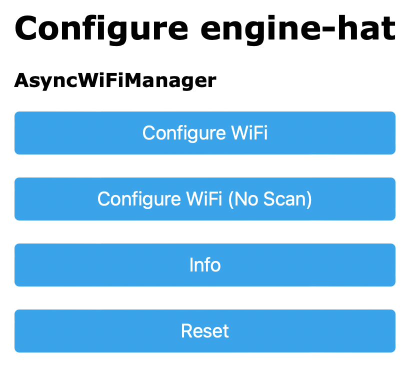
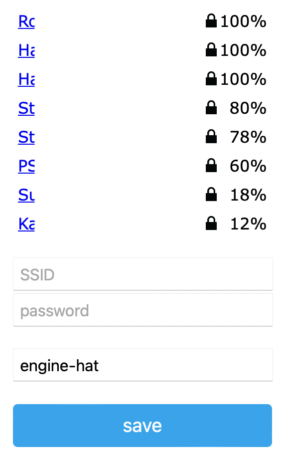
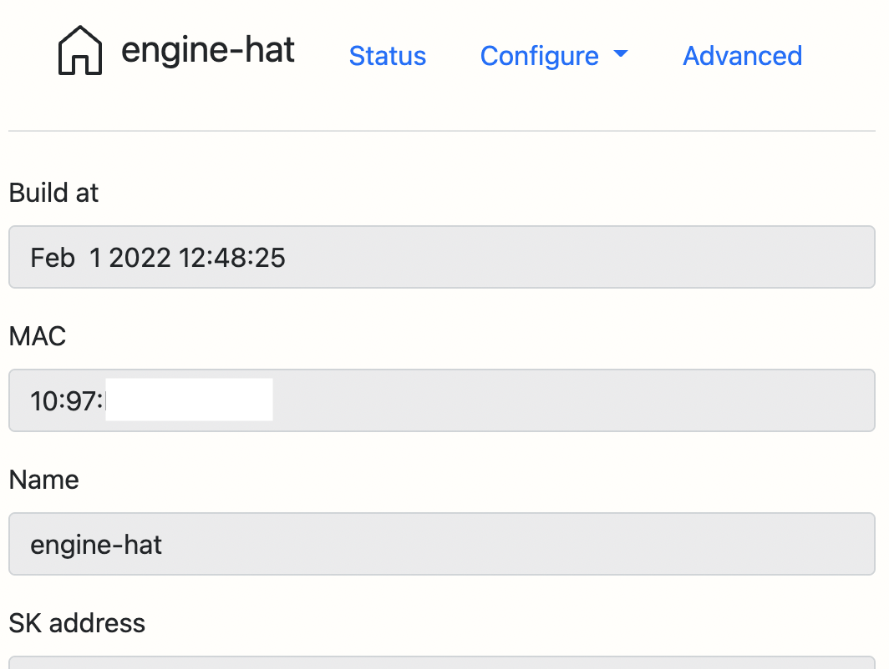
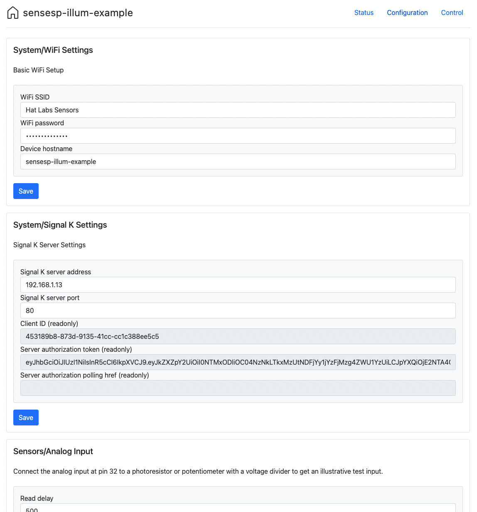
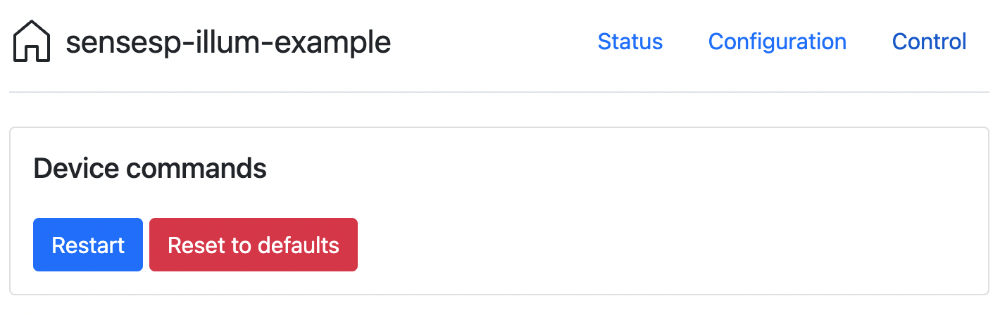

# User Interface

SensESP has five ways to interface with you, the user:

* PlatformIO Serial Monitor
* Initial Setup UI
* Run-time Configuration UI
* The Blinking LED
* Remote Debugging

## PlatformIO Serial Monitor

There are a lot of status and error messages that will display on the Serial Monitor in PlatformIO, especially during the SensESP startup phase (from boot until the time data is being sent to the Signal K Server). Especially during your initial experimentation with SensESP, it's a very good idea to bring up that window in PlatformIO (click the little icon on the bottom row that looks like a wall plug) and look at the messages.

If you want to see all the messages from the boot, bring up the Serial Monitor, then push and release the physical reset button on your ESP32.

If you're not seeing these messages, they may be disabled in `main.cpp`. All of the example files have this code in them:

```c++
#ifndef SERIAL_DEBUG_DISABLED
  SetupSerialDebug(115200);
#endif
```
so if you see `#define SERIAL_DEBUG_DISABLED` anywhere above those lines, that will disable the Serial Monitor messages from SensESP.

## Initial Setup (WiFi and Hostname)

When you start your ESP32 device the first time after uploading SensESP onto it, it needs to know what wifi network to connect to -- unless you have hard-coded the WiFi credentials, of course. SensESP will automatically create a WiFi Access Point of its own for configuration purposes. Connect your computer or phone to the “Configure SensESP” network; the password is `thisisfine`. Note: If you hard-coded the `hostname` in `main.cpp`, the SSID will be called "Configure yourHostname". A captive portal may pop up, but if it doesn’t, open a browser and go to 192.168.4.1, and you should see this:

{:width="250px"}

Click on "Configure WiFi". You should then see a list of nearby WiFi networks:

{:width="250px"}

Pick the SSID and enter the password of your WiFi network that your Signal K Server is on. You can also change the device hostname, if you want.

Save the configuration with the button on the bottom of the page, and the device will restart and try to connect to your wifi network. If it connects successfully, you'll never have to bring this configuration page up again, unless you change your wifi's SSID or password.

## Run-time Configuration

Some Sensors and Transform have parameters that can be configured "live", by accessing the SensESP device through its hostname or IP address, entered as a URL in any browser.

To access the web UI, you have to find out the device hostname or IP address first.
There are several ways to do this:

1. On many operating systems, mDNS hostnames are the easiest solution: the SensESP device will be discoverable as [`https://sensesp.local`](https://sensesp.local), or `myhostname.local` if you have changed the hostname to `myhostname`.
2. You can find out the device IP address by looking at the top of the Serial Monitor.
3. Internet router devices typically have a user interface that allows listing of the clients together with their IP addresses.
4. Network scanners such as [nmap](https://nmap.org) can be used to find out the IP address of the device.

Once you have found out the hostname or IP address and enter the URL in a browser, you should see the SensESP web UI Status Page:

{:width="400px"}

The status page displays useful information about the device.

The top menu allows you to configure the device or control it.
First, the configuration page:

{:width="400px"}

The configuration page shows all available configurable objects as individual editor cards on a single page.
You can adjust the parameter values and save the configuration.

Finally, the Control menu shows different built-in and application controls you can use to control the device behavior.

{:width="400px"}

* "Restart device" will restart the ESP.
* "Reset device" will not erase the program, but it will erase all the wifi information, the Signal K server information and authorization token, and any Sensor and Transform configuration you've done.
  The next time the device boots, you'll need to re-enter the wifi SSID and password (unless you have hard-coded the WiFi information, of course).
  All configurable values will be back at the defaults set in the program, and you will have to authorize the device with Read/Write access on the Signal K Server.

## The Blinking LED

Most ESP32's have a built-in LED that can be programmed. SensESP uses that capability to help you know the status of the program, as it goes through its normal phases: starting up, connecting to wifi, making the WebSocket connection to the Signal K Server. (BAS: what does it do when it's up and running and sending data?)

Each item below represents one of the LED System Status blink patterns. The `*` represent the time the LED is on, the `_` represent the time it's off.) The numbers are the milliseconds that correspond to the `*` and the `_`.

No WiFi Access Point found

```
*___________________
```

 50, 950

Wifi credentials have not been set up yet, either by hard-coding in `main.cpp` or using the Wifi Manager web UI. If you see this, you need to go through the steps described above in the [Initial Setup](##initial-setup-(wifi-and-hostname)).

```
********************
```

1000, 0

Trying to connect to wifi (SSID and password already setup)

```
******______________
```

300, 700

Connected to wifi (this one doesn't last long, as it goes almost immediately to the next one below)
```
**************______
```

700, 300

Connecting to the Signal K Server (trying to make the WebSocket connection)

```
*************_*_*_*_
```

650, 50, 50, 50, 50, 50, 50, 50

Connected to the Signal K Server

```
******************__
```

900, 100

Connected to the Server, checking the authorization. If you see this for more than just a few seconds, you probably need to go to the Signal K Server's web interface and authorize the security request

```
****____
```

200, 200

Websocket disconnected

```
*_*_*_*_____________
```

50, 50, 50, 50, 50, 50, 50, 650

## Remote Debugging
