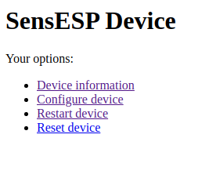
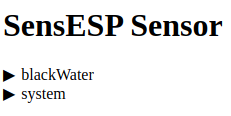

# User Interface

SensESP has five ways to interface with you, the user:

* PlatformIO Serial Monitor
* Initial Setup UI
* Run-time Configuration UI
* The Blinking LED
* Remote Debugging

## PlatformIO Serial Monitor

There are a lot of status and error messages that will display on the Serial Monitor in PlatformIO, especially during the SensESP startup phase (from boot until the time data is being sent to the Signal K Server). Especially during your initial experimentation with SensESP, it's a very good idea to bring up that window in PlatformIO (click the little icon on the bottom row that looks like a wall plug) and look at the messages.

If you want to see all the messages from the boot, bring up the Serial Monitor, then push and release the physical reset button on your ESP32.

If you're not seeing these messages, they may be disabled in `main.cpp`. All of the example files have this code in them:

```c++
#ifndef SERIAL_DEBUG_DISABLED
  SetupSerialDebug(115200);
#endif
```
so if you see `#define SERIAL_DEBUG_DISABLED` anywhere above those lines, that will disable the Serial Monitor messages from SensESP.

## Initial Setup (Wifi and Hostname)

When you start your ESP the first time after uploading SensESP onto it, it needs to know what wifi network to connect to[^1]. It will broadcast a wifi SSID for you to connect to so you can configure it. Connect your computer or phone to the “Configure SensESP”[^2] network; the password is `thisisfine`. A captive portal may pop up, but if it doesn’t, open a browser and go to 192.168.4.1, and you should see this:

(BAS: Picture here of the Wifi Manager on a phone.)

Enter the SSID and password of your boat’s wifi - the network that your Signal K Server is on. Also enter a suitable name for the ESP: for example, "BilgeMonitor" or "EngineTemps". (No more than 32 characters, no spaces.) Save the configuration with the button on the bottom of the page, and the ESP will restart and try to connect to your wifi network. If it connects successfully, you'll never have to bring this configuration page up again, unless you change your wifi's SSID or password.

[^1]: Unless you [hard-coded](pages/getting_started/index.md#hard-coding-certain-program-attributes)(BAS: this link doesn't work) the wifi credentials in `main.cpp`.
[^2]: If you hard-coded the `hostname` in `main.cpp`, the SSID will be called "Configure yourHostname".

## Run-time Configuration

Some Sensors and Transform have parameters that can be configured "live", by accessing the ESP through its IP address, entered as a URL in any browser. (For details on how to set this up in your `main.cpp`, [click here](../concepts/index.md). (BAS: this link doesn't work.) For example, entering `192.168.1.236` (the IP address of the ESP32 I'm currently using as I write this documentation) in a browser will bring up the following web page that's hosted by the ESP itself:



* "Device information" displays some information about the ESP, the firmware, the wifi network, etc.
* "Configure device" is explained below.
* "Restart device" will restart the ESP.
* "Reset device" will not erase the program, but it will erase all the wifi information, the Signal K server information and authorization token, and any Sensor and Transform configuration you've done. The next time the device boots, you'll need to re-enter the wifi SSID and password[^3] (see above), all configurable values will be back at the defaults set in the program, and you will have to authorize the device with Read/Write access on the Signal K Server.

[^3]: Unless you have hard-coded the wifi info.

Click on "Configure device" to bring up the /setup page, which will look something like this:



The only menu item that will always be present is "system", which has two sub-menus: "networking" (which lets you see and edit your wifi SSID and password, and the ESP's hostname), and "sk", which displays some networking info, but can't currently be used for editing that info.

Other menu item(s) (in this example, only "blackWater") are there only if you've provided a configuration path in the constructor of one or more of the Sensors and Transforms in `main.cpp`.

## The Blinking LED

Most ESP32's have a built-in LED that can be programmed. SensESP uses that capability to help you know the status of the program, as it goes through its normal phases: starting up, connecting to wifi, making the WebSocket connection to the Signal K Server. (BAS: what does it do when it's up and running and sending data?)

Each item below represents one of the LED System Status blink patterns. The `*` represent the time the LED is on, the `_` represent the time it's off.) The numbers are the milliseconds that correspond to the `*` and the `_`.

*___________________
no_ap 50, 950 (BAS: what does this one represent? It can't find the SSID it's looking for, or does it have something to do with the Wifi Manager AP?)

Wifi credentials have not been set up yet, either by hard-coding in `main.cpp` or using the Wifi Manager web UI. If you see this, you need to go through the steps described above in the [Initial Setup](##initial-setup-(wifi-and-hostname)).
********************
1000, 0

Trying to connect to wifi (SSID and password already setup)
******______________
300, 700

Connected to wifi (this one doesn't last long, as it goes almost immediately to the next one below)
**************______
700, 300

Connecting to the Signal K Server (trying to make the WebSocket connection)
*************_*_*_*_
650, 50, 50, 50, 50, 50, 50, 50

Connected to the Signal K Server
******************__
ws_connected 900, 100

Connected to the Server, checking the authorization. If you see this for more than just a few seconds, you probably need to go to the Signal K Server's web interface and authorize the security request
****____
ws_authorizing 200, 200

(BAS: Does this happen only after a successful connection, and then a disconnect? Like the server suddenly is offline?)
*_*_*_*_____________
ws_disconnected {50, 50, 50, 50, 50, 50, 50, 650

## Remote Debugging
