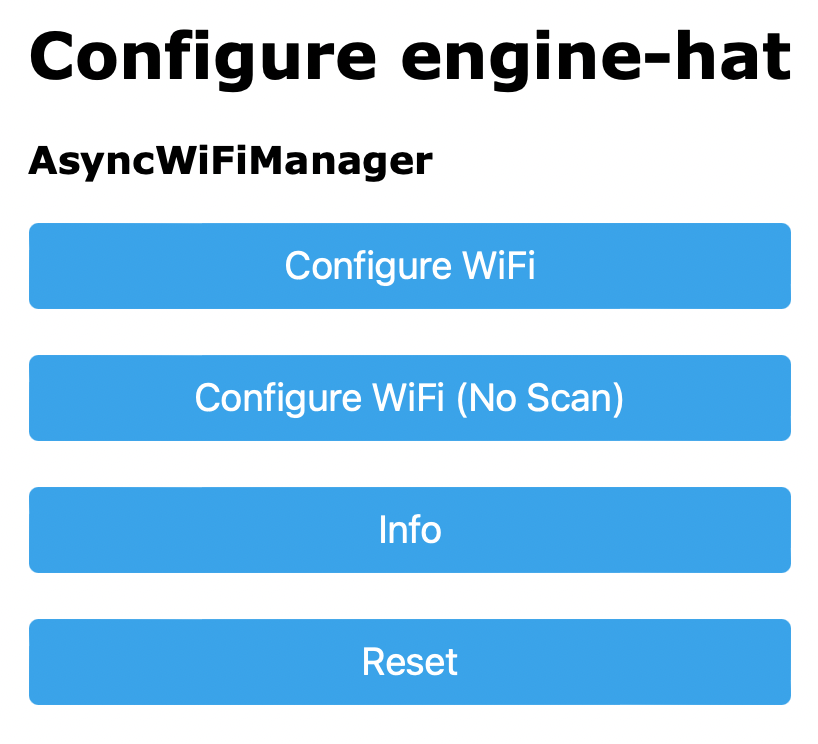
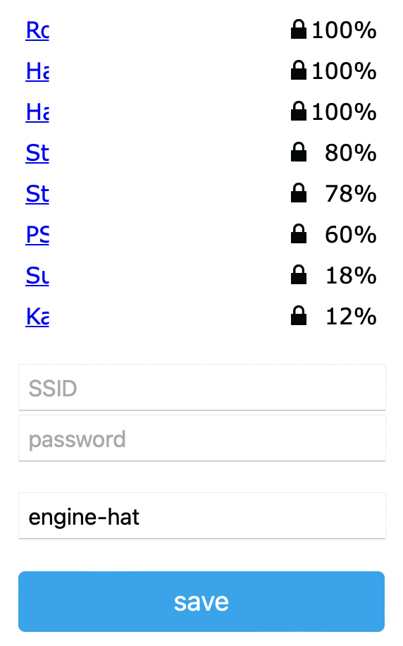
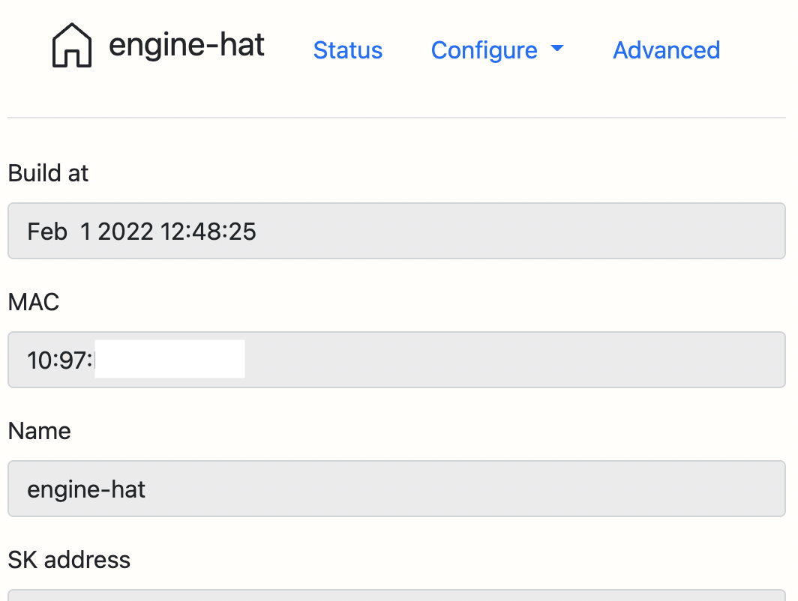
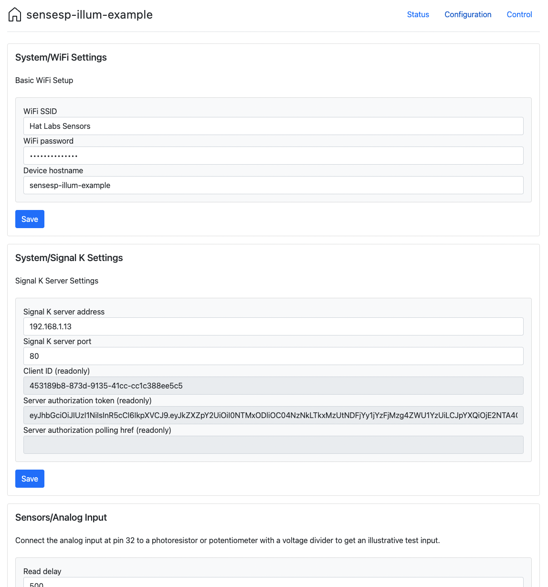
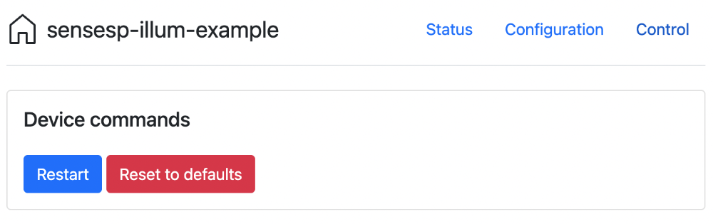

# User Interface

SensESP has five ways to interface with you, the user:

* PlatformIO Serial Monitor
* Initial Setup UI
* Run-time Configuration UI
* The Blinking LED
* Remote Debugging

## PlatformIO Serial Monitor

There are a lot of status and error messages that will display on the Serial Monitor in PlatformIO, especially during the SensESP startup phase (from boot until the time data is being sent to the Signal K Server). Especially during your initial experimentation with SensESP, it's a very good idea to bring up that window in PlatformIO (click the little icon on the bottom row that looks like a wall plug) and look at the messages.

If you want to see all the messages from the boot, bring up the Serial Monitor, then push and release the physical reset button on your ESP32.

SensESP uses the ESP-IDF logging system. Ensure `SetupLogging()` is called at the beginning of your `setup()` function to initialize it:

```c++
void setup() {
  SetupLogging();
  // ...
}
```

If you're not seeing any log messages, check that `SetupLogging()` is present in your `main.cpp`.

## Initial Setup (WiFi and Hostname)

When you start your ESP32 device the first time after uploading SensESP onto it, it needs to know what WiFi network to connect to — unless you have hard-coded the WiFi credentials, of course. SensESP has a built-in WiFi provisioner that automatically creates a WiFi access point for configuration purposes.

Connect your computer or phone to the access point named “Configure SensESP” (or “Configure yourHostname” if you set a custom hostname in `main.cpp`). The password is `thisisfine`.

A captive portal should open automatically. If it doesn’t, open a browser and go to `192.168.4.1`. The captive portal serves the same web UI used for runtime configuration — from here you can configure WiFi client connections, change the hostname, and more.

<!-- TODO: Update screenshot for v3 web UI -->
{:width=”250px”}

<!-- TODO: Update screenshot for v3 web UI -->
{:width=”250px”}

Pick the SSID and enter the password of your WiFi network that your Signal K Server is on. Save the configuration, and the device will restart and try to connect to your WiFi network.

**Note:** The WiFi access point remains enabled by default even after you configure a client WiFi connection. If you don’t need the AP anymore, disable it explicitly through the web UI. You can also re-enable it at any time if you need to reconfigure the device.

## Run-time Configuration

Some Sensors and Transforms have parameters that can be configured "live", by accessing the SensESP device through its hostname or IP address, entered as a URL in any browser. The web UI is built with Preact and Bootstrap.

To access the web UI, you have to find out the device hostname or IP address first.
There are several ways to do this:

1. On many operating systems, mDNS hostnames are the easiest solution: the SensESP device will be discoverable as [`http://sensesp.local`](http://sensesp.local), or `myhostname.local` if you have changed the hostname to `myhostname`.
2. You can find out the device IP address by looking at the top of the Serial Monitor.
3. Internet router devices typically have a user interface that allows listing of the clients together with their IP addresses.
4. Network scanners such as [nmap](https://nmap.org) can be used to find out the IP address of the device.

Once you have found out the hostname or IP address and enter the URL in a browser, you should see the SensESP web UI Status Page:

<!-- TODO: Update screenshot for v3 web UI -->
{:width="400px"}

The status page displays useful information about the device.

The top menu allows you to configure the device or control it.
First, the configuration page:

<!-- TODO: Update screenshot for v3 web UI -->
{:width="400px"}

The configuration page shows all available configurable objects as individual editor cards on a single page. Configuration cards are rendered for objects wrapped in `ConfigItem()` in your code. You can adjust the parameter values and save the configuration.

You can optionally protect the web UI with HTTP Digest Authentication by calling `set_admin_user()` on the SensESP builder during setup.

Finally, the Control menu shows different built-in and application controls you can use to control the device behavior.

<!-- TODO: Update screenshot for v3 web UI -->
{:width="400px"}

* "Restart device" will restart the ESP.
* "Reset device" will not erase the program, but it will erase all the WiFi information, the Signal K server information and authorization token, and any Sensor and Transform configuration you've done.
  The next time the device boots, you'll need to re-enter the WiFi SSID and password (unless you have hard-coded the WiFi information, of course).
  All configurable values will be back at the defaults set in the program, and you will have to authorize the device with Read/Write access on the Signal K Server.

## The Blinking LED

Most ESP32's have a built-in LED that can be programmed. SensESP uses that capability to help you know the status of the program, as it goes through its normal phases: starting up, connecting to wifi, making the WebSocket connection to the Signal K Server. (BAS: what does it do when it's up and running and sending data?)

Each item below represents one of the LED System Status blink patterns. The `*` represent the time the LED is on, the `_` represent the time it's off.) The numbers are the milliseconds that correspond to the `*` and the `_`.

No WiFi Access Point found

```
*___________________
```

 50, 950

Wifi credentials have not been set up yet, either by hard-coding in `main.cpp` or using the Wifi Manager web UI. If you see this, you need to go through the steps described above in the [Initial Setup](##initial-setup-(wifi-and-hostname)).

```
********************
```

1000, 0

Trying to connect to wifi (SSID and password already setup)

```
******______________
```

300, 700

Connected to wifi (this one doesn't last long, as it goes almost immediately to the next one below)
```
**************______
```

700, 300

Connecting to the Signal K Server (trying to make the WebSocket connection)

```
*************_*_*_*_
```

650, 50, 50, 50, 50, 50, 50, 50

Connected to the Signal K Server

```
******************__
```

900, 100

Connected to the Server, checking the authorization. If you see this for more than just a few seconds, you probably need to go to the Signal K Server's web interface and authorize the security request

```
****____
```

200, 200

Websocket disconnected

```
*_*_*_*_____________
```

50, 50, 50, 50, 50, 50, 50, 650

## Remote Debugging

RemoteDebug (the telnet-based remote debugger) was removed in SensESP v3. Logging now uses standard ESP-IDF logging via the `ESP_LOGx()` macros: `ESP_LOGE`, `ESP_LOGW`, `ESP_LOGI`, `ESP_LOGD`, and `ESP_LOGV`.

The old `debugX()` functions still work as compatibility wrappers, so existing code won't break — but new code should use the ESP-IDF macros directly.

See the Logging section of the [Migration Guide](../migration_guide/) for details on setting up logging in v3.
