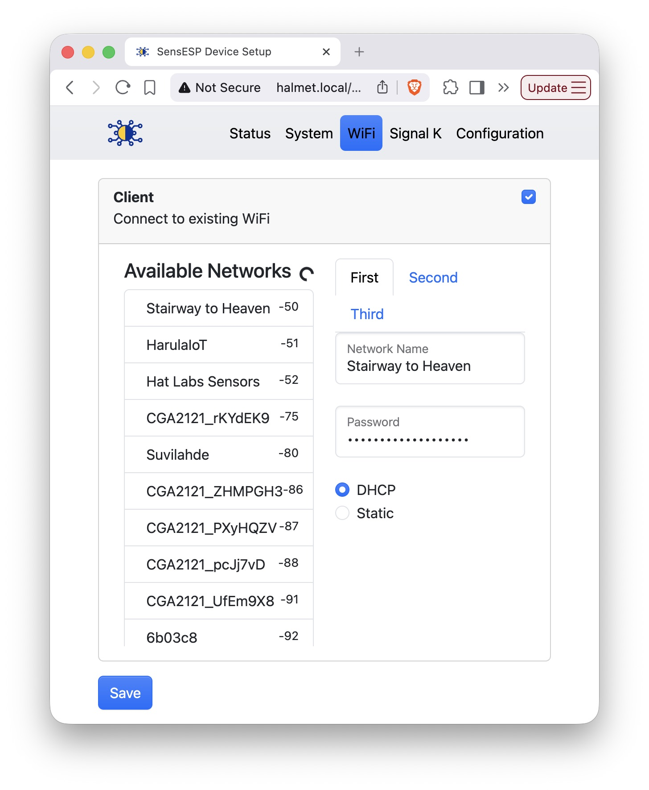
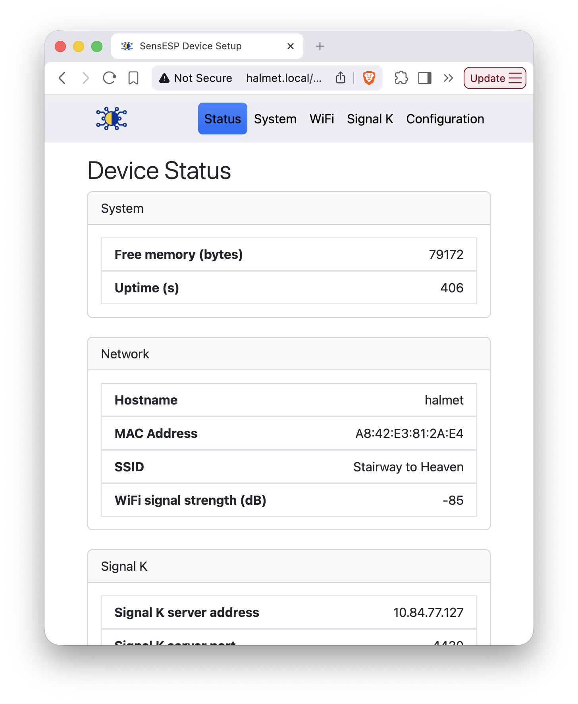
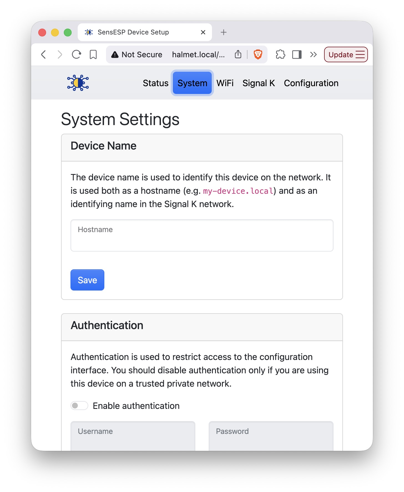
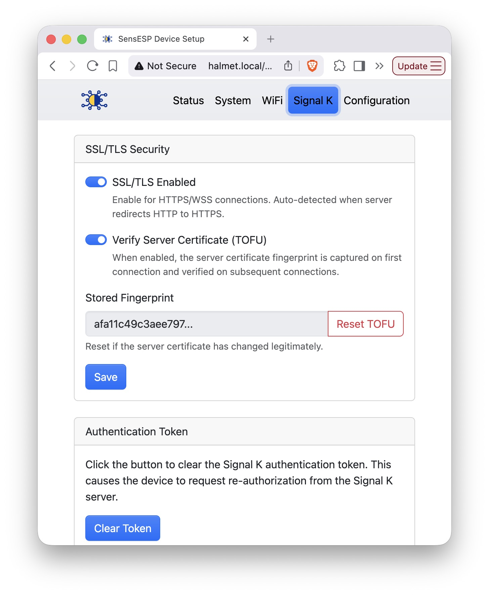
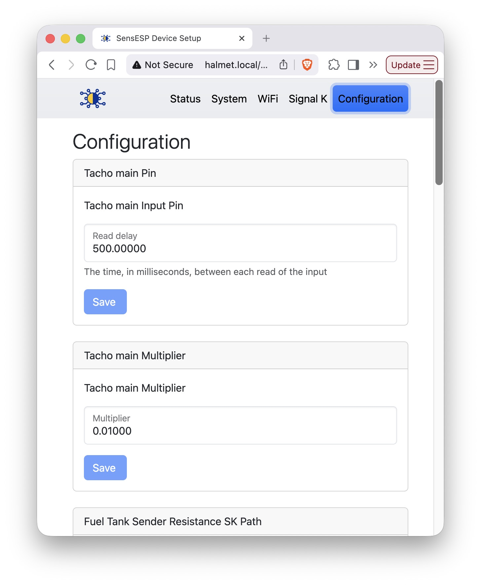

# User Interface

SensESP has five ways to interface with you, the user:

* PlatformIO Serial Monitor
* Initial Setup UI
* Run-time Configuration UI
* The Blinking LED
* Remote Debugging

## PlatformIO Serial Monitor

There are a lot of status and error messages that will display on the Serial Monitor in PlatformIO, especially during the SensESP startup phase (from boot until the time data is being sent to the Signal K Server). Especially during your initial experimentation with SensESP, it's a very good idea to bring up that window in PlatformIO (click the little icon on the bottom row that looks like a wall plug) and look at the messages.

If you want to see all the messages from the boot, bring up the Serial Monitor, then push and release the physical reset button on your ESP32.

SensESP uses the ESP-IDF logging system. Ensure `SetupLogging()` is called at the beginning of your `setup()` function to initialize it:

```c++
void setup() {
  SetupLogging();
  // ...
}
```

If you're not seeing any log messages, check that `SetupLogging()` is present in your `main.cpp`.

## Initial Setup (WiFi and Hostname)

When you start your ESP32 device the first time after uploading SensESP onto it, it needs to know what WiFi network to connect to — unless you have hard-coded the WiFi credentials, of course. SensESP has a built-in WiFi provisioner that automatically creates a WiFi access point for configuration purposes.

Connect your computer or phone to the access point named “SensESP” (or whatever you set as the hostname in `main.cpp`). The default password is `thisisfine`.

A captive portal should open automatically. If it doesn’t, open a browser and go to `192.168.4.1`. The captive portal serves the same web UI used for runtime configuration — from here you can configure WiFi client connections, change the hostname, and more.

{:width=”400px”}

Pick the SSID and enter the password of your WiFi network that your Signal K Server is on. You can configure up to three WiFi networks — the device will cycle through them if a connection fails. Save the configuration, and the device will restart and try to connect to your WiFi network.

**Note:** The WiFi access point remains enabled by default even after you configure a client WiFi connection. If you don’t need the AP anymore, disable it explicitly through the web UI. You can also re-enable it at any time if you need to reconfigure the device.

## Run-time Configuration

Some Sensors and Transforms have parameters that can be configured "live", by accessing the SensESP device through its hostname or IP address, entered as a URL in any browser. The web UI is built with Preact and Bootstrap.

To access the web UI, you have to find out the device hostname or IP address first.
There are several ways to do this:

1. On many operating systems, mDNS hostnames are the easiest solution: the SensESP device will be discoverable as [`http://sensesp.local`](http://sensesp.local), or `myhostname.local` if you have changed the hostname to `myhostname`.
2. You can find out the device IP address by looking at the top of the Serial Monitor.
3. Internet router devices typically have a user interface that allows listing of the clients together with their IP addresses.
4. Network scanners such as [nmap](https://nmap.org) can be used to find out the IP address of the device.

Once you have found out the hostname or IP address and enter the URL in a browser, you should see the SensESP web UI Status Page:

{:width="400px"}

The status page displays useful information about the device: free memory, uptime, network details, and Signal K connection status.

The top menu bar provides access to the different configuration tabs. The **System** tab lets you change the device hostname and configure authentication:

{:width="400px"}

You can optionally protect the web UI with HTTP Digest Authentication by calling `set_admin_user()` on the SensESP builder during setup, or by enabling it on this page.

The **WiFi** tab (shown above in the Initial Setup section) lets you manage WiFi client and access point settings. The **Signal K** tab shows the connection security settings and authentication token:

{:width="400px"}

The **Configuration** tab shows all available configurable objects as individual editor cards. Configuration cards are rendered for objects wrapped in `ConfigItem()` in your code. You can adjust the parameter values and save the configuration.

{:width="400px"}

The **System** tab also contains device control actions:

* "Restart device" will restart the ESP.
* "Reset device" will not erase the program, but it will erase all the WiFi information, the Signal K server information and authorization token, and any Sensor and Transform configuration you've done.
  The next time the device boots, you'll need to re-enter the WiFi SSID and password (unless you have hard-coded the WiFi information, of course).
  All configurable values will be back at the defaults set in the program, and you will have to authorize the device with Read/Write access on the Signal K Server.

## The Blinking LED

Most ESP32 boards have a built-in LED that SensESP uses to indicate device status. The LED blink pattern tells you what the device is doing at a glance.

| LED | Status | What to do |
|:---:|:-------|:-----------|
|  | **WiFi not configured** — short flash, long pause | Connect to the device AP and configure WiFi (see [Initial Setup](#initial-setup-wifi-and-hostname)) |
|  | **WiFi AP active**, waiting for configuration | Same as above — the LED stays on continuously |
|  | **Connecting to WiFi** | Wait — the device is trying to connect |
|  | **WiFi connected** | Usually transitions quickly to the next state |
|  | **Connecting to Signal K** — long on, quick flicker | Wait — establishing WebSocket connection |
|  | **Connected to Signal K** | Normal operation |
|  | **Checking authorization** — steady fast blink | If this persists, approve the access request on the Signal K server web UI |
|  | **WebSocket disconnected** — quick flicker, long pause | Check Signal K server and network connectivity |

## Remote Debugging

RemoteDebug (the telnet-based remote debugger) was removed in SensESP v3. Logging now uses standard ESP-IDF logging via the `ESP_LOGx()` macros: `ESP_LOGE`, `ESP_LOGW`, `ESP_LOGI`, `ESP_LOGD`, and `ESP_LOGV`.

The old `debugX()` functions still work as compatibility wrappers, so existing code won't break — but new code should use the ESP-IDF macros directly.

See the Logging section of the [Migration Guide](../migration/) for details on setting up logging in v3.
