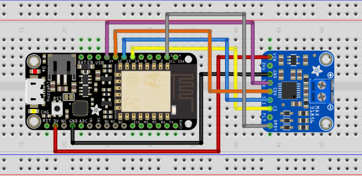
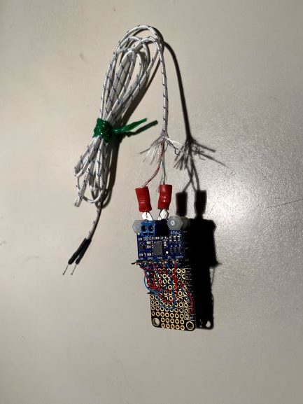
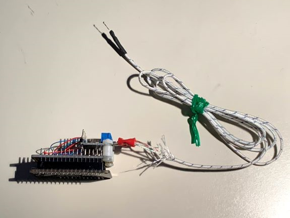

# Thermocouple engine temperature sensor

 ## Introduction
 
 On my boat, the engine temperature gauge is placed about ankle level to the left of the wheel. Not a place you look often when steering. Never once in all of the times the engine, for one reason or another, has overheated, did I discover it until there was billows of steam coming out of the exhaust. A better solution to monitoring engine temperatuer is clearly warranted. 

This example implements a thermocouple temperature sensor usig the Adafruit MAX31856 break-out board and an Adafruit Feather HUZZAH ESP8266 running SensESP to communicate the engine temperature wirelessly to the SignalK navigation system.

## Hardware

The connections for the Huzzah and MAX31856 are shown in the figure below.

 

In pactice, the MAX31856 is screewed to the top of the Huzzah on a Feather prototyping "Featherwing" with nylon screws and short nylon standoffs. Electrical connections have been made with wire-wrap. It is easier to alter if later if you want to alter the wiring.

  

  

The Max31856 thermocouple amplifier will not work with a grounded thermocouple tip. I have placed two layers of shrink tubing around the TC tip and then clamped it to the engine between two washers. This seems to work but the metal washers might be replaced with nylon which melts about 220 C - higher than needed for the engine temperature applicaiton.

## Software

The Thermocouple engine temperature sensor is implemented in software with two files src/sensors/max31856TC_input.h and src/sensors/max31856_input.cpp. The MAX31856 breakout board communicates with the Huzzah through software SPI and if you want to use pins other than SPI_CS_PIN 15, SPI_MOSI_PIN 13, SPI_MISO_PIN 12 and SPI_CLK_PIN 14 or a thermocouple other than Type-K, you will need to make the appropriate adjustments in max31856TC_input.h and recompile SensESP. 

To make changes to SensESP, fork the SensESP repo and then clone it to your local PC. 

To implement thermocouple engine temperature sensor, create a new PlatformIO project, select the Adafruit HUZZAH ESP8266 as the board, select Arduino as the framework, check the box "Use default location" and copy the contents of the file max31856TC_example.cpp into src/main.cpp.

The platformio.ini file that has been used for this project is listed below. Copy the contents of this file and use it to replace the contents of the default platformio.ini file. You may need to adjust it to correspond to your choice of board. 

```
; PlatformIO Project Configuration File
;
;   Build options: build flags, source filter
;   Upload options: custom upload port, speed and extra flags
;   Library options: dependencies, extra library storages
;   Advanced options: extra scripting
;
; Please visit documentation for the other options and examples
; https://docs.platformio.org/page/projectconf.html

[env:huzzah]
platform = espressif8266
board = huzzah
framework = arduino
monitor_speed = 115200
board_build.f_cpu = 160000000L
upload_resetmethod = nodemcu
build_flags =
   -Wl,-Teagle.flash.4m1m.ld
   -Wall
   -Wno-reorder

upload_speed = 115200
lib_deps =
    C:\Users\RBerliner\Documents\PlatformIO\SensESP
    ReactESP@^0.2.2
    ESP8266WebServer
    DNSServer
    ESPAsyncTCP
    ESP Async WebServer
    ESP8266WiFi
    ESP8266mDNS
    ESPAsyncWiFiManager
    ArduinoJson@^5.0.0
    WebSockets
    OneWire
    DallasTemperature
    ESP8266TrueRandom
    https://github.com/JoaoLopesF/RemoteDebug.git#0b5a9c1a49fd2ade0e3cadc3a3707781e819359a
    Adafruit ADS1X15
    Wire
    Adafruit BME280 Library
    Adafruit BMP280 Library
    Adafruit SHT31 Library
    Adafruit INA219

extra_scripts = extra_script.py
```
As can be seen from the first entry under lib-deps, the local SensESP repo is being used for the project. This is necessary if you are going to change the SPI pins or TC type. Otherwise this line can be replaced with:

https://github.com/SignalK/SensESP.git