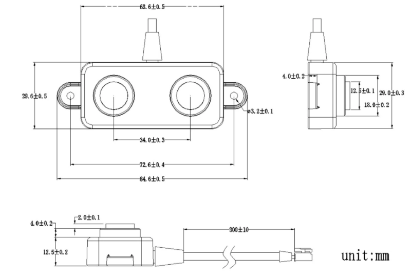
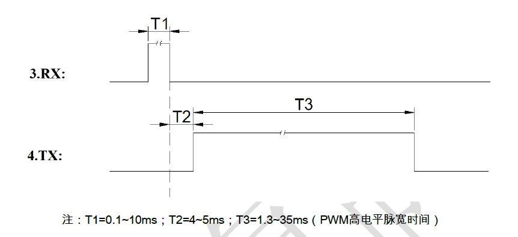

# Ultrasonic Distance Sensor Water Tank Monitor

 ## Introduction
 
 The DYP-A02YYWM-V1.0 is a waterproof ultrasonic sensor with a small blind-spot that can measure ranges from 3 cm to 4.3 m. It can be found at AliExpress ($16.49). It is a high performance ranging module with a sealed split waterproof probe. It is suitable for wet and harsh measurement environments. 
 
 
## Features
 
  * 3cm small blind spot
  * 5V power supply
  * Operating current is less than 15mA
  * UART auto output, PWM output, two output options
  * Closed split waterproof probe
  * Operating temperature -15 ° C to +60 ° C
  * Storage temperature -25°C to +80°C

  

## Hardware

The sensor has been implemented using an Adafruit Feather HUZZAH ESP8266 and SignalK/SensESP. It requires no signal conditioning and connects directly to the HUZZAH (powered by 5v).

The sensor has a pigtail cable with 4 wires. The connection to the HUZZAH is shown below:

| Function | HUZZAH | Sensor Color |
|:--------:|:------:|-------------:|
| 5 V      |   USB  |  Red         |
| Trigger  | IO15   |  Yellow      |
| Output   | IO14   |  White       |
| Gnd      |  Gnd   | Black        |

## Software

The ultrawsonic distance sensor is implemented in software with the two files SensESP/src/sensors/ultrasonic_input.cpp and SensESP/src/sensors/ultrasonic_input.h. According to the manufacturer, the receipt of a Trigger pulse 100 microsec wide causes the sensor to emit a pulse whose width is proportional to 2X the travel time between the sensor and the reflecting surface. 

  

In practice I found that with T1 = 0.1 ms, T2 ~ 15 ms. The distance (in cm) to the reflecting object is given by 2*distance = pulse_width/speed_of_sound with the pulse_width (T3) in micro-sec and the the 2*speed of sound = 58 micro-sec/cm.

If you use an Adafruit Feather Huzzah ESP8266 and the same wiring as above, you can use SensESP as a library. If  you intend to change wiring, you will have to adjust the definitions in src/sensors/ultrasonic_input.h and recompile SensESP. 

To make changes to SensESP, fork the SensESP repo and then clone it to your local PC. 

To implement ultrasonic distance sensor, create a new PlatformIO project, select your board, select Arduino as the framework, check the box "Use default location" and copy the contents of the file ultrasonic_DVP_example.cpp into src/main.cpp. The sensor will require calibration unless you intend the raw distance ouptut values. The calibration can be seen in the file ultrasonic_DVP_example.cpp.

The platformio.ini file that has been used for this project is listed below. If you intend to recompile SensESP, copy the contents of this file and use it to replace the contents of the default platformio.ini file. You may need to adjust it to correspond to your choice of board. 

```
; PlatformIO Project Configuration File
;
;   Build options: build flags, source filter
;   Upload options: custom upload port, speed and extra flags
;   Library options: dependencies, extra library storages
;   Advanced options: extra scripting
;
; Please visit documentation for the other options and examples
; https://docs.platformio.org/page/projectconf.html

[env:huzzah]
platform = espressif8266
board = huzzah
framework = arduino
monitor_speed = 115200
board_build.f_cpu = 160000000L
upload_resetmethod = nodemcu
build_flags =
   -Wl,-Teagle.flash.4m1m.ld
   -Wall
   -Wno-reorder

upload_speed = 115200
lib_deps =
    C:\Users\RBerliner\Documents\PlatformIO\SensESP
    ReactESP@^0.2.2
    ESP8266WebServer
    DNSServer
    ESPAsyncTCP
    ESP Async WebServer
    ESP8266WiFi
    ESP8266mDNS
    ESPAsyncWiFiManager
    ArduinoJson@^5.0.0
    WebSockets
    OneWire
    DallasTemperature
    https://github.com/sivar2311/ESPTrueRandom.git
    https://github.com/JoaoLopesF/RemoteDebug.git#0b5a9c1a49fd2ade0e3cadc3a3707781e819359a
    Adafruit ADS1X15
    Wire
    Adafruit BME280 Library
    Adafruit BMP280 Library
    Adafruit SHT31 Library
    Adafruit INA219

extra_scripts = extra_script.py
```
As can be seen from the first entry under lib-deps, the local SensESP repo is being used for the project. This is necessary if you are going to change the sensor wiring copnnections. If you are not going to recompile SensESP, this line can be replaced with:

https://github.com/SignalK/SensESP.git