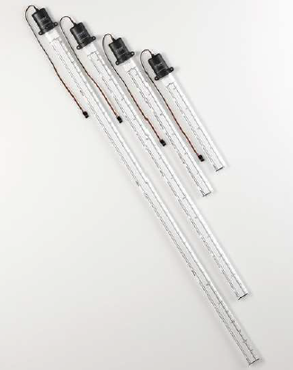
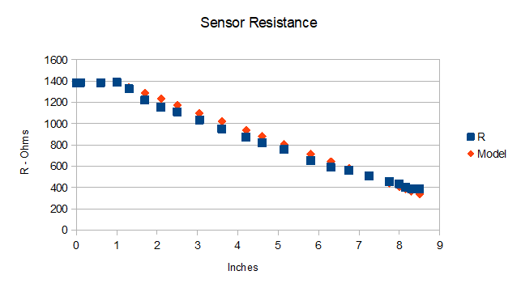

# Milone- eTape Fluid Level Sensor
## Device Description, Connection and Calibration

The Milone eTape fluid level sensor is a solid state sensor that makes use of a printed circuit board instead of moving mechanical floats. 
The eTape's envelope is compressed by hydrostatic pressure of the fluid in which it is immersed resulting in a change of resistance which corresponds
to the distance from the top of the sensor to the fluid surface.

This device is to be used to monitor freshwater tank water level.

The eTape comes in various lengths (5", 8", 10", 12") and can be purchased either as the bare tape or as an encapsulated assembly. For ease of mounting in the water tank, we opted to use the 8" assembly which includes an oval cylindrical polycarbonate tube that protects the sensor.

  

The assembly comes with a pigtail lead with 3 wires: red, white and black. The eTape, which can be modeled as a variable resistor is connected to the red and white leads. The white-black leads connect to a fixed (voltage divider) reference resistor of 1450 Ohm for the 8" sensor.

To connect the sensor to the 1 V range ADC for the ESP8266, the red lead is connected to the VBUS (5V) ESP8266 pin. The white lead is connected to the ESP8266 A0 (ADC) input and a 100 Ohm resistor is connected from the A0 input to Gnd. 

Calibration data and the calibration graph are shown below.

| Depth 	| R  	| Model 	|
|-	|-	|-	|
| 0 	| 1386 	|  	|
| 0.1 	| 1386 	|  	|
| 0.6 	| 1386 	|  	|
| 1 	| 1387.4 	| 1386.000 	|
| 1.3 	| 1329 	| 1344.000 	|
| 1.7 	| 1221 	| 1288.000 	|
| 2.1 	| 1155 	| 1232.000 	|
| 2.5 	| 1112 	| 1176.000 	|
| 3.05 	| 1036 	| 1099.000 	|
| 3.6 	| 953 	| 1022.000 	|
| 4.2 	| 872 	| 938.000 	|
| 4.6 	| 823 	| 882.000 	|
| 5.15 	| 757 	| 805.000 	|
| 5.8 	| 654 	| 714.000 	|
| 6.3 	| 590 	| 644.000 	|
| 6.75 	| 563 	| 581.000 	|
| 7.25 	| 511 	| 511.000 	|
| 7.75 	| 457 	| 441.000 	|
| 8 	| 436 	| 406.000 	|
| 8.15 	| 400 	| 385.000 	|
| 8.3 	| 390 	| 364.000 	|
| 8.5 	| 388 	| 336.000 	|

  

The sensor appears to be basically insensitive for the bottom 1" of the device. After that, it fits a linear model of decreasing resistance where the 
fluid level height x is given by:

##       x = (1385 - R)/140 - 1.  
        
The model calculation is shown in the table and in the graph. 

## Software Implementation

The supporting software for the Milone eTape is based on SensESP and is an extension of the AnalogInput example. Because of the way the sensor has been connected to the ESP8266 
(measuring the voltage across the fixed reference resistor) it was necessary to add a new class to SensESP, the VoltageDividerR1 class. In addition, code has been added to the AnalogInput example to output intermediate results from the sensor level calculation.
