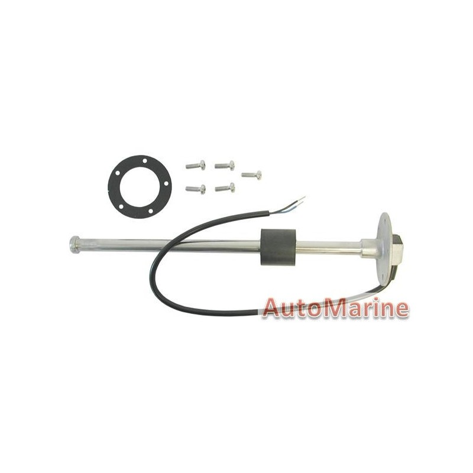

# Fuel level sensor

 ## Introduction

Example of a SensESP fuel level sensor implementation. Designed to be used with a 0-180 (VDO) type (linear resistance) transducer, as pictured below.

## Connection
The circuit required to measure the resistance is based on this: [voltage divider calculator](http://www.ohmslawcalculator.com/voltage-divider-calculator). Basically you connect 1 transducer wire to ground (GND), another one to A0 (SIGNAL) and put a resistor between the 3.3v rail and the SIGNAL wire (in series with A0). The circuit works because the resistance of the fixed resistor is a known value, hence we can deduce the value of the transducer.

## Software
To use this code, you need to perform a measurement of your min/max values once and adjust the `scale` factor accordingly. See `fuel_level_sensor_example` in this folder for details.