# Onewire temperature sensor(s)

 ## Introduction

This example implements onewire temperature sensors using 'Dallas DS18B20 temperature sensor' connected to a Wemos D1-Mini running SensESP to communicate the engine cooling temperature wirelessly to the Signal K server.

## Hardware

The raw DS18B20 sensor from Maxim looks like this:

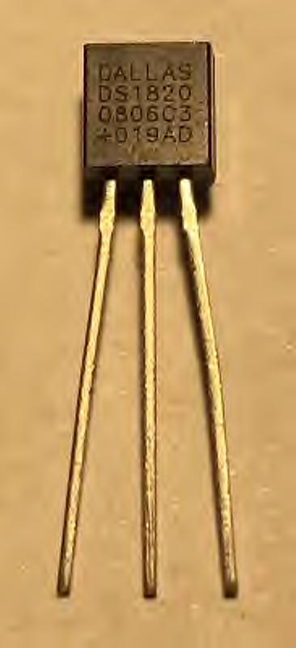

Here is the [Datasheet](https://datasheets.maximintegrated.com/en/ds/DS18B20.pdf) for this sensor

You can buy this type of sensor in this package in many online stores that sell electronic components:

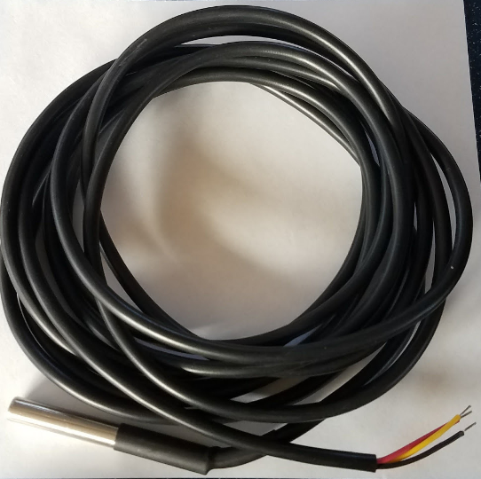

You connect ds18b20 sensors like this example:

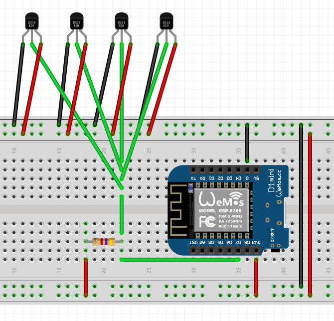

You can connect 1 to "many" sensors to one ESP Device, wire lengths greater than 10 meters can cause problems. For more details, see [ESP Easy Wiki](https://www.letscontrolit.com/wiki/index.php?title=Dallas_DS18b20)

## Software

### Step 1
Create a new project in PlatformIO as described here: [README.md](../../README.md)

### Step 2
Copy and paste all text in [onewire_temperature_example.cpp](onewire_temperature_example.cpp) file in this folder to `main.cpp` in your PlatformIO project.

### Step 3
SenseESP needs to know where the sensor(s) are connected to the board, edit this section in the code:

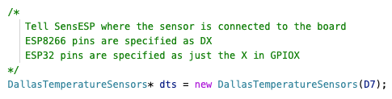

### Step 4
Edit this part of the example to reflect your needs:

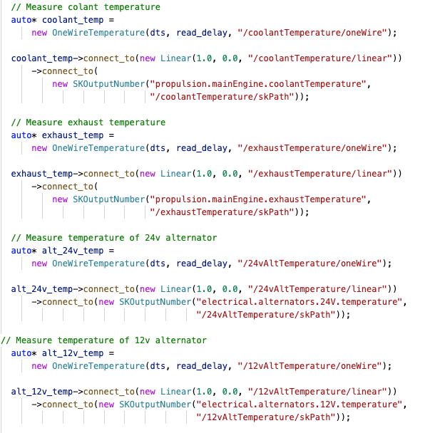

If you for example only have 2 sensors you remove the two last sensors in the code, if you have more, copy and paste in more sensors.

Rename sensors to what they measure according to the selected places in this picture:

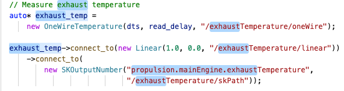

### Step 5
It's time to upload the code to the ESP, make sure it's connected to the computer. Click "Upload and Monitor All", firmware will now be built and uploaded to the board if no errors are found. Once the firmware is uploaded the monitor will start showing what the SenseESP is doing.

Result in monitor at first boot after loading firmware:
```
␛[0m(I) (load_configuration) Not loading configuration: file does not exist: /system/networking
␛[0m(I) (load_configuration) Not loading configuration: file does not exist: /system/sk
```
Here you can see that 4 sensors are found:
```
␛[0m(I) (DallasTemperatureSensors) Found OneWire sensor 10:d0:87:92:01:08:00:9e
␛[0m(I) (DallasTemperatureSensors) Found OneWire sensor 10:ce:97:92:01:08:00:aa
␛[0m(I) (DallasTemperatureSensors) Found OneWire sensor 10:65:c1:92:01:08:00:07
␛[0m(I) (DallasTemperatureSensors) Found OneWire sensor 10:6f:c6:92:01:08:00:99
```
This part is normal to see at first startup, there is no config files saved at this stage:
```
␛[0m(I) (load_configuration) Not loading configuration: file does not exist: /coolantTemperature/oneWire
␛[0m(D) (OneWireTemperature) Registered a new OneWire sensor
␛[0m(I) (load_configuration) Not loading configuration: file does not exist: /coolantTemperature/linear
␛[0m(I) (load_configuration) Not loading configuration: file does not exist: /exhaustTemperature/oneWire
␛[0m(D) (OneWireTemperature) Registered a new OneWire sensor
␛[0m(I) (load_configuration) Not loading configuration: file does not exist: /exhaustTemperature/linear
␛[0m(I) (load_configuration) Not loading configuration: file does not exist: /24vAltTemperature/oneWire
␛[0m(D) (OneWireTemperature) Registered a new OneWire sensor
␛[0m(I) (load_configuration) Not loading configuration: file does not exist: /24vAltTemperature/linear
␛[0m(I) (load_configuration) Not loading configuration: file does not exist: /12vAltTemperature/oneWire
␛[0m(D) (OneWireTemperature) Registered a new OneWire sensor
␛[0m(I) (load_configuration) Not loading configuration: file does not exist: /12vAltTemperature/linear
␛[0m(I) (load_configuration) Not loading configuration: file does not exist: /12vAltTemperature/linear
```
Here are all paths that will be reported to Signal K server:
```
␛[0m(I) (enable) Connecting SignalK source SensESP.systemhz
␛[0m(I) (enable) Connecting SignalK source SensESP.uptime
␛[0m(I) (enable) Connecting SignalK source SensESP.freemem
␛[0m(I) (enable) Connecting SignalK source SensESP.ipaddr
␛[0m(I) (enable) Connecting SignalK source SensESP.wifisignal
␛[0m(I) (enable) Connecting SignalK source propulsion.mainEngine.coolantTemperature
␛[0m(I) (enable) Connecting SignalK source propulsion.mainEngine.exhaustTemperature
␛[0m(I) (enable) Connecting SignalK source electrical.alternators.24V.temperature
␛[0m(I) (enable) Connecting SignalK source electrical.alternators.12V.temperature
```
Network related information:
```
␛[0m(I) (enable) Enabling subsystems
␛[0m(I) (enable) Subsystem: setup_discovery()
␛[0m(I) (setup_discovery) mDNS responder started at SensESP
␛[0m(I) (enable) Subsystem: networking->setup()
␛[0m*WM: Adding parameter
*WM: hostname
*WM: 
*WM: AutoConnect Try No.:
*WM: 0
*WM: Connecting as wifi client...
*WM: Try to connect with saved credentials
*WM: Connection result: 
*WM: 0
*WM: SET AP STA
*WM: 
*WM: Configuring access point... 
*WM: Configure SensESP
```
Here is the IP of the sensor when it is started in AP mode:
```
*WM: AP IP address: 
*WM: 192.168.4.1
*WM: HTTP server started

```

### Step 7
Now the SenseESP is started and is waiting to be configured. Connect to the "Configure SensESP" network. Shortly after you connect, a web page should open and you should see the image below. If a web page doesn't open, you may have to manually open a page to 192.168.4.1.


Click "Configure WiFi" and you see this:

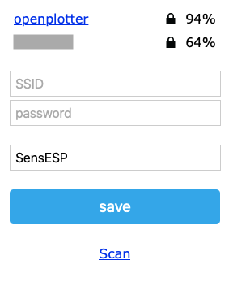

Click on your network and some info will be filled in for you, fill in missing information and give the ESP Device a name, like "EngineTemp" or some other meaningful name:

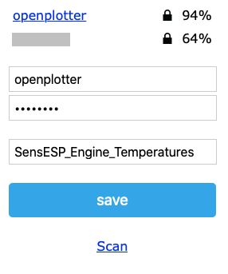

Click save and the ESP Device will reboot and try to connect to your WiFi. If something is wrong it will appear as an access point again and you can correct settings.
If all is good the SensESP will connect to your WiFi and search for your Signal K server.

Below is the output after WiFi is configured, the first part is as before:
```
␛[0m(I) Serial debug enabled
␛[0m(W) (set_configuration) Using saved SSID and password
␛[0m(I) (DallasTemperatureSensors) Found OneWire sensor 10:d0:87:92:01:08:00:9e
␛[0m(I) (DallasTemperatureSensors) Found OneWire sensor 10:ce:97:92:01:08:00:aa
␛[0m(I) (DallasTemperatureSensors) Found OneWire sensor 10:65:c1:92:01:08:00:07
␛[0m(I) (DallasTemperatureSensors) Found OneWire sensor 10:6f:c6:92:01:08:00:99
␛[0m(I) (load_configuration) Not loading configuration: file does not exist: /coolantTemperature/oneWire
␛[0m(D) (OneWireTemperature) Registered a new OneWire sensor
␛[0m(I) (load_configuration) Not loading configuration: file does not exist: /coolantTemperature/linear
␛[0m(I) (load_configuration) Not loading configuration: file does not exist: /exhaustTemperature/oneWire
␛[0m(D) (OneWireTemperature) Registered a new OneWire sensor
␛[0m(I) (load_configuration) Not loading configuration: file does not exist: /exhaustTemperature/linear
␛[0m(I) (load_configuration) Not loading configuration: file does not exist: /24vAltTemperature/oneWire
␛[0m(D) (OneWireTemperature) Registered a new OneWire sensor
␛[0m(I) (load_configuration) Not loading configuration: file does not exist: /24vAltTemperature/linear
␛[0m(I) (load_configuration) Not loading configuration: file does not exist: /12vAltTemperature/oneWire
␛[0m(D) (OneWireTemperature) Registered a new OneWire sensor
␛[0m(I) (load_configuration) Not loading configuration: file does not exist: /12vAltTemperature/linear
␛[0m(I) (enable) Connecting SignalK source SensESP_Engine_Temp.systemhz
␛[0m(I) (enable) Connecting SignalK source SensESP_Engine_Temp.uptime
␛[0m(I) (enable) Connecting SignalK source SensESP_Engine_Temp.freemem
␛[0m(I) (enable) Connecting SignalK source SensESP_Engine_Temp.ipaddr
␛[0m(I) (enable) Connecting SignalK source SensESP_Engine_Temp.wifisignal
␛[0m(I) (enable) Connecting SignalK source propulsion.mainEngine.coolantTemperature
␛[0m(I) (enable) Connecting SignalK source propulsion.mainEngine.exhaustTemperature
␛[0m(I) (enable) Connecting SignalK source electrical.alternators.24V.temperature
␛[0m(I) (enable) Connecting SignalK source electrical.alternators.12V.temperature
␛[0m(I) (enable) Enabling subsystems
␛[0m(I) (enable) Subsystem: setup_discovery()
␛[0m(W) (setup_discovery) Error setting up mDNS responder
␛[0m(I) (enable) Subsystem: networking->setup()
```

Here you can see that SenseESP is connecting to WiFi openplotter and gets IP 10.10.10.153:
```
␛[0m(I) (setup_saved_ssid) Connecting to wifi openplotter.
␛[0m(I) (setup_saved_ssid) Wifi status=6, time=500 ms
␛[0m(I) (setup_saved_ssid) Wifi status=3, time=1000 ms
␛[0m(I) (setup_saved_ssid) Connected to wifi, SSID: openplotter (signal: -57)
␛[0m(I) (setup_saved_ssid) IP address of Device: 10.10.10.153
␛[0m(I) (enable) Subsystem: setup_OTA()
␛[0m(I) (enable) Subsystem: http_server()
␛[0m(I) (enable) Subsystem: ws_client()
␛[0m(I) (enable) WS client enabled
␛[0m(D) (enable_all) Enabling all required sensors and transforms
␛[0m(I) (enable) All sensors and transforms enabled
␛[0m(D) (connect) Initiating connection
```

Here is the server found at IP address 10.10.10.1, port 3000:
```
␛[0m(I) (get_mdns_service) Found server 10.10.10.1 (port 3000)
␛[0m(I) (connect) SignalK server has been found at address 10.10.10.1:3000 by mDNS.
␛[0m(D) (connect) Websocket is connecting to SignalK server on address 10.10.10.1:3000
```

The last step before SensESP can send data to the server is to authorize it from the Signal K Server Admin Page.
```
␛[0m(D) (poll_access_request) Polling SK Server for authentication token
␛[0m(D) (poll_access_request) PENDING
```

Log in to your Signal K server and browse the menu tree:


Click on the waiting unit:

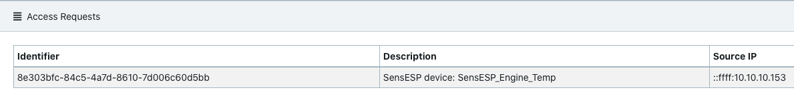

Fill in the details and make sure that you have selected Read/Write:

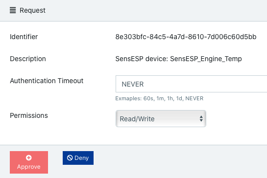

### Step 8 (optional)
If you have more than one sensor connected to SensESP they will be connected to a Signal K path more or less at random. This means that you need to figure out what sensor is connected to what path.
The easies way to do this is when the sensors are still on your desk, you can simply pinch one sensor between your fingers and then look in the web GUI to see what sensor that has the highest temperature.
Then mark that sensor with a label telling where it belongs. Repeat this process until you only have one senor left.

If you have already installed the sensors and can't easily access them, you still have to somehow increase the temperature of a particular sensor to see which one in Signal K increases simultaneously. Then you may have to copy-paste the addresses among the sensors in the Config UI to get them all set up correctly.

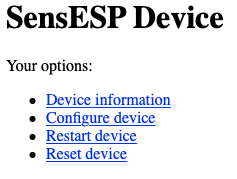


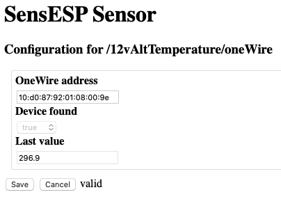

## Verify result

Last thing, verify that data is transferred to Signal K by looking in the Signal K Server's "Data Browser":

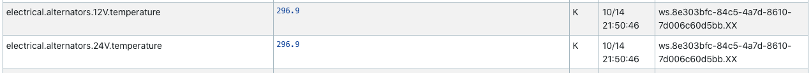

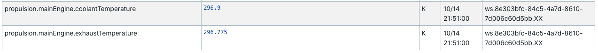

## Congratulations!

Well done! You have successfully deployed a new ESP Device running SensESP!