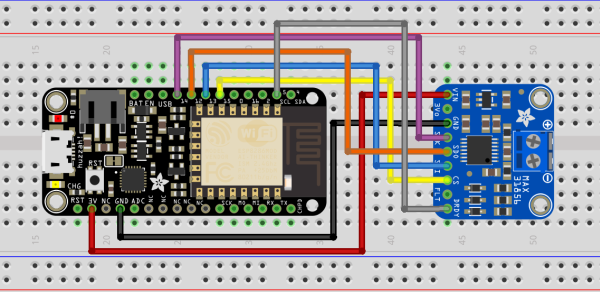
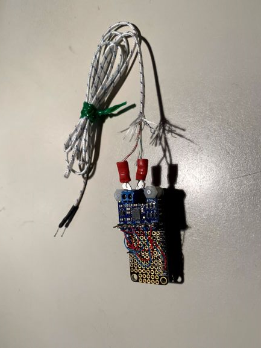

# Thermocouple engine temperature sensor

 ## Introduction

This example implements a thermocouple temperature sensor using the Adafruit MAX31856 break-out board and an Adafruit Feather HUZZAH ESP8266 running SensESP to communicate the engine temperature wirelessly to Signal K.

## Hardware

The connections for the Huzzah and MAX31856 are shown in the figure below.

 

In practice, the MAX31856 is screwed to the top of the Huzzah on a Feather prototyping "Featherwing" with nylon screws and short nylon standoffs. Electrical connections have been made with wire-wrap. It is easier to alter if later if you want to alter the wiring.

  

  

The Max31856 thermocouple amplifier will not work with a grounded thermocouple tip. I have placed two layers of shrink tubing around the TC tip and then clamped it to the engine between two washers. This seems to work but the metal washers might be replaced with nylon which melts about 220 C - higher than needed for the engine temperature application.

## Software

The Thermocouple engine temperature sensor is implemented in software with two files src/sensors/thermocouple_temperature_sensor/max31856_thermocouple.h and max31856_thermocouple.cpp.