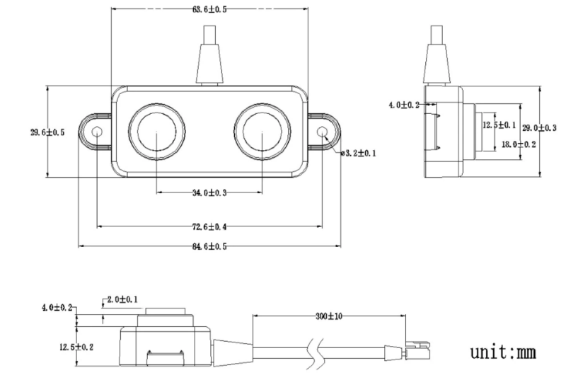
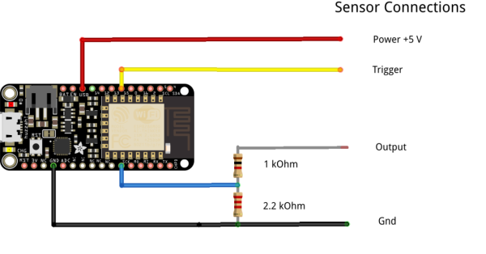
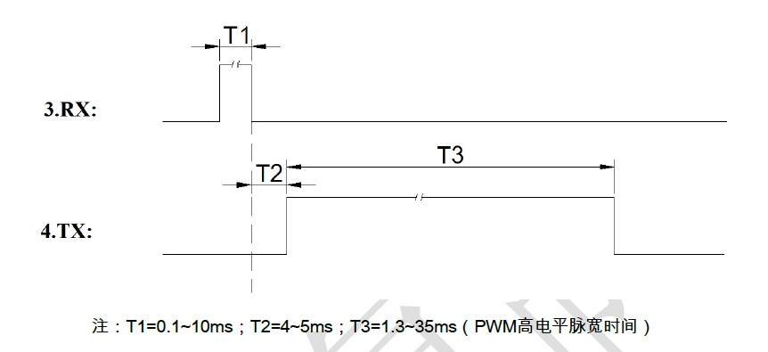

# Ultrasonic Distance Sensor Water Tank Monitor

 ## Introduction
 
 The DYP-A02YYWM-V1.0 is a waterproof ultrasonic sensor with a small blind-spot that can measure ranges from 3 cm to 4.3 m. It can be found at AliExpress ($16.49). It is a high performance ranging module with a sealed split waterproof probe. It is suitable for wet and harsh measurement environments. 
 
 
## Features
 
  * 3cm small blind spot
  * 5V power supply
  * Operating current is less than 15mA
  * UART auto output, PWM output, two output options
  * Closed split waterproof probe
  * Operating temperature -15 ° C to +60 ° C
  * Storage temperature -25°C to +80°C

  

## Hardware

The sensor has been implemented using an Adafruit Feather HUZZAH ESP8266 and SignalK/SensESP. It requires only a voltage divider for signal conditioning to reduce the 5V output pulse to 3 V and gets power directly from the HUZZAH (powered by 5v).

The sensor has a pigtail cable with 4 wires. The connection to the HUZZAH is shown below:

| Function | HUZZAH | Sensor Color |
|:--------:|:------:|-------------:|
| 5 V      |   USB  |  Red         |
| Trigger  | IO15   |  Yellow      |
| Output   | IO14   |  White       |
| Gnd      |  Gnd   | Black        |

  

## Software

The ultrawsonic distance sensor is implemented in software with the two files SensESP/src/sensors/ultrasonic_level_sensor/ultrasonic_input.cpp and ultrasonic_input.h. According to the manufacturer, the receipt of a Trigger pulse 100 microsec wide causes the sensor to emit a pulse whose width is proportional to 2X the travel time between the sensor and the reflecting surface. 

  

In practice I found that with T1 = 0.1 ms, T2 ~ 15 ms. The distance (in cm) to the reflecting object is given by 2*distance = pulse_width/speed_of_sound with the pulse_width (T3) in micro-sec and the the 2*speed of sound = 58 micro-sec/cm.
